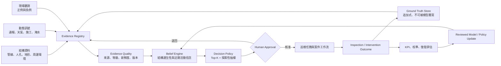
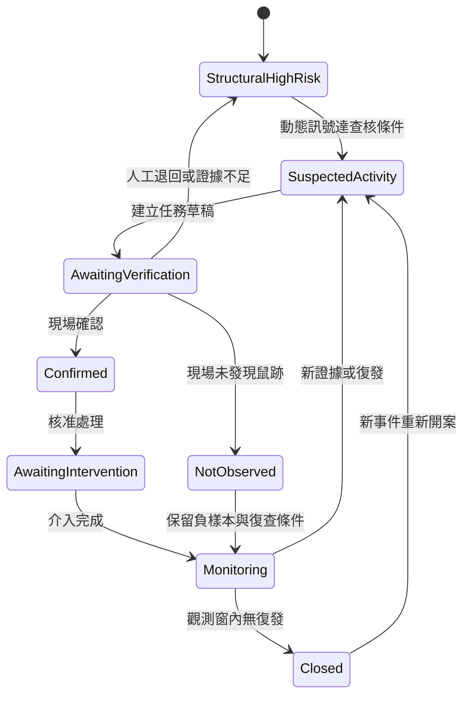

# SubTerrat Harness 架構

> Evidence–Belief–Decision–Action Loop for underground sewer rat-risk inspection

## 1. 文件定位

本文件定義 SubTerrat 的候選產品架構與 Harness 邊界。系統目標不是宣稱「預測臺北所有鼠患」，而是協助城市維運單位根據地下管網、周邊環境與最新證據，排序有限巡檢資源，追蹤處理結果，並用現場回饋修正後續判斷。

本文件同時扮演兩個角色：

1. **產品／Agent 架構 Guide**：說明 Evidence、Belief、Decision、Action、Feedback 如何連成可稽核閉環。
2. **未來 CoH Harness 的候選 authority**：提供 routes、Sensors、proof boundaries 與 maintenance triggers 的設計來源；目前尚未被 `.coh/model.json` 採用。

### 目前證據狀態

| 狀態 | 內容 |
| --- | --- |
| `OBSERVED` | `/Users/hjc/CodeSpace/SubTerrat` 在本文件建立前為空目錄，且不是 Git repository。 |
| `OBSERVED` | ChatGPT Pro 討論將核心缺口歸納為證據鏈、決策鏈、責任鏈，並建議以人孔／管段的巡檢優先序作為主要輸出。 |
| `OBSERVED` | 討論採用 Seattle 下水道管線特徵與鼠類存在研究作為科學假設來源，並強調臺北 Ground Truth 仍需自行取得。 |
| `INFERRED` | SubTerrat 的 MVP 主要使用者是市府內部巡檢、管網維護與病媒防治人員。 |
| `UNKNOWN` | 實際資料授權、欄位品質、目標時間窗、每日巡檢容量、正式權責單位與臺北在地標籤目前均未確認。 |
| `UNKNOWN` | 尚無程式、資料管線、部署環境、測試、CI 或 production evidence。 |

CoH `set-up` 的本次唯讀 Need Gate 結果為 `INSUFFICIENT_EVIDENCE`：目標目錄沒有 Git HEAD，無法產生 task-bound BuildPlan。這不影響先建立候選架構文件，但不得把本文件描述成已完成的 CoH Harness Model。

## 2. 中心命題與主張邊界

### 2.1 中心命題

**臺北地下管網鼠類活動風險監測與巡檢決策系統**

候選 Agent 描述：

> Sewer Risk Agent 持續整合地下管網結構、環境先驗與動態證據，維護每個人孔／管段的可追溯 Belief，提出巡檢任務草稿，經人工核准後追蹤處理與復發。

### 2.2 決策單位與輸出

- 分析單位：人孔或管段。
- 主要輸出：指定時間窗內的 Top-K 巡檢優先序。
- 每筆建議至少包含：原因、證據等級、資料新鮮度、不確定度、下一步、負責單位與案件狀態。
- MVP 決策介面：市府內部 Web 地圖＋案件工作臺。
- 公開介面：只顯示聚合區域與治理狀態，不顯示精確管線、人孔、住宅或店家風險。

### 2.3 明確非目標

系統不應宣稱或自動執行：

- 預測個人感染漢他病毒或其他疾病。
- 精確估算鼠群數量。
- 判定特定店家或住宅「有鼠患」。
- 把單一民眾通報當成 Ground Truth。
- 未經人工核准直接建立 1999 對外案件。
- 自動投藥、封堵、修繕或發布公共衛生警報。
- 把 Seattle 模型參數直接視為臺北已驗證模型。

## 3. 核心閉環



閉環必須維持三項分離：

1. **Belief** 是根據目前證據形成、可被更新的推論。
2. **Operational State** 是案件或巡檢正在進行到哪一步。
3. **Ground Truth** 是經定義程序取得的觀測結果，不因模型分數改變。

## 4. Evidence 架構

### 4.1 證據類別

| 類別 | 候選內容 | 角色 |
| --- | --- | --- |
| 結構性先驗 | 管線類型、管徑、深度、年代、材質、坡度、海拔、人孔、拓撲、鄰近食物來源 | 形成較慢變動的棲地／活動先驗 |
| 動態訊號 | 民眾通報、照片、天氣、淹水、施工、清運、短期重複事件 | 更新近期活動 Belief，不直接等同標籤 |
| 現場觀測 | 非毒性餌塊消耗、鼠糞、鼠洞、咬痕、捕捉、專業巡檢 | 建立正例與負例 Ground Truth |
| 介入結果 | 清潔、封堵、捕鼠、投藥、管線修繕、兩週／四週復查 | 評估治理效果與復發 |
| 治理資料 | 任務建立、核准、轉派、逾期、結案與重新開案 | 描述責任與處理狀態，不應回灌成獨立生物證據 |

### 4.2 候選證據等級

| 等級 | 定義 | 可支持的主張 |
| --- | --- | --- |
| `E0` | 單一、尚未驗證的民眾通報 | 存在需要查核的訊號 |
| `E1` | 具照片／影片、多人獨立重複通報或其他交叉訊號 | 活動疑似程度提高，仍非現場確認 |
| `E2` | 專業人員現場確認鼠跡，或依固定程序確認無鼠跡 | 在指定時間與位置的現場觀測 |
| `E3` | 捕捉、實體樣本或實驗室檢驗 | 指定樣本的直接證據；不自動外推為區域疾病風險 |

每筆 Evidence 至少需要：

- `evidence_id`
- `source_type` 與 `source_id`
- 空間範圍與座標系統
- `observed_at`、`ingested_at`、有效時間窗
- 證據等級與品質旗標
- 原始資料版本／雜湊或可追溯引用
- 是否為人類、感測器、模型或系統產生
- 隱私與公開層級
- 是否可作為訓練標籤

### 4.3 防止自我強化

- 系統產生的任務一律標記 `source=system`。
- 系統任務、模型分數與案件狀態不得作為新的獨立活動證據。
- 1999 或其他民眾通報若是由系統觸發，不得回灌成民眾證據。
- 相同事件的重複資料需做 entity resolution，避免多算。
- 訓練資料必須記錄「未發現鼠跡」的負樣本。
- 上線後的巡檢配置應保留探索樣本，例如 80% Top-K、20% 隨機或分層抽樣；比例須依資源與研究設計確認。

## 5. Belief 架構

### 5.1 Belief 定義

Belief 是 Agent 在特定模型版本、時間與證據集合下，對不可直接完整觀察狀態的估計。它不是事實，也不是案件狀態。

每個人孔／管段至少維護兩種可分離 Belief：

1. **Structural Suitability Belief**：此位置是否具備較高的長期棲地／活動條件。
2. **Recent Activity Belief**：指定時間窗內是否可能存在近期鼠類活動。

`Inspection Priority` 是根據 Belief、資源限制、公共安全規則與探索策略形成的決策，不應被存成第三種「真相 Belief」。

### 5.2 候選 Belief record

```json
{
  "belief_id": "belief:<asset_id>:<as_of>:<model_version>",
  "asset_id": "manhole-or-segment-id",
  "as_of": "RFC3339 timestamp",
  "model_version": "candidate-model-version",
  "structural_suitability": {
    "score": 0.0,
    "calibrated_probability": null
  },
  "recent_activity": {
    "score": 0.0,
    "calibrated_probability": null,
    "time_window": "UNKNOWN"
  },
  "uncertainty": {
    "method": "UNKNOWN",
    "value": null
  },
  "evidence_refs": [],
  "evidence_level_max": "E0",
  "freshness": "current|stale|unknown",
  "explanation_factors": [],
  "limitations": [],
  "supersedes": null
}
```

在尚未取得臺北 E2／E3 標籤並完成校準前：

- `score` 只能稱為文獻先驗風險篩選分數。
- `calibrated_probability` 必須為 `null`。
- 不得以「鼠患機率 85%」等語句呈現。
- Belief 更新應保留先前版本，不可就地覆寫而失去 provenance。

### 5.3 Belief 更新規則

概念上：

```text
Belief_t = Update(Belief_t-1, NewEvidence_t, EvidenceQuality, ModelVersion)
Decision_t = Policy(Belief_t, Capacity, Cost, ExplorationQuota, SafetyRules)
```

候選規則：

- 結構特徵形成 prior；動態訊號更新近期活動估計。
- 證據有時間衰減，但 E2／E3 歷史觀測仍保留為訓練與復發資料。
- 缺資料應增加 uncertainty，不可自動解讀成低風險。
- 互相衝突的證據保留為 `CONFLICTING`，不得任選一方覆蓋。
- 模型版本更換時重算新 Belief record，並保留舊版以供比較。
- 人工可以否決行動，但不能無痕修改模型輸出或 Ground Truth。
- LLM 可協助生成可讀解釋，不得創造 Evidence、調高等級或替代決策規則。

## 6. Agent 與案件狀態

MVP 使用一個具持續狀態的 Sewer Risk Agent；模型、排序器、案件處理與公共衛生 guardrail 先作為模組，不為了展示 A2A 而拆成多個假 Agent。

### 6.1 Agent 權限

可執行：

- 整合已授權資料並更新 Belief。
- 產生巡檢任務草稿與理由。
- 要求補充證據。
- 追蹤已核准任務、逾期與復查。
- 產生內部通知或跨局處轉派建議。

需人工核准：

- 正式派工或跨局處轉派。
- 對外建立案件或通知民眾。
- 公共衛生升級。
- 現場介入措施。
- 對外公開風險資訊。

禁止：

- 自動診斷疾病。
- 自動將模型輸出升級為 Ground Truth。
- 未核准即對外通報或指認店家／住宅。
- 自動改寫模型 policy、Guide 或 Sensor。

### 6.2 Operational state machine



狀態轉移必須記錄 actor、時間、前置證據、核准者與 reason code。

## 7. 模型與驗證

### 7.1 候選模型階段

1. **Literature baseline**：以 Seattle 研究支持的管線物理特徵建立可解釋篩選分數。
2. **Local supervised baseline**：取得臺北 E2 正負樣本後，建立 GAM／Logistic 等可校準 baseline。
3. **Graph extensions**：加入 degree、betweenness、dead-end、network distance、鄰近管段風險等特徵。
4. **Dynamic evidence**：加入通報、天氣、施工、淹水與近期巡檢。
5. **Ablation**：逐層確認每一組特徵是否在時空外推情境下增加價值。

Centrality 只能是待驗證特徵，不能被當成核心答案。管網需保留方向、長度、坡度、缺漏與可能的雙向鼠類移動假設。

### 7.2 評估設計

- 時間向前切分，防止 future leakage。
- Spatial block split，避免鄰近位置洩漏。
- 留一行政區測試，觀察地理外推能力。
- Precision@K、Recall@K、PR-AUC。
- 若輸出 probability，必須檢查 calibration。
- 相同巡檢人力下，每 100 次巡檢確認鼠跡的件數。
- 提前發現時間、任務完成時間、復發率與介入成效。
- Top-K exploitation 與 exploration 樣本分開報告。

不能只報整體 accuracy，也不能以離線指標替代實際城市營運成效。

## 8. 資料、介面與治理邊界

### 8.1 三個視圖

- **結構性風險層**：管線年代、管徑、深度、材質、類型、拓撲、周邊食物來源。
- **動態活動證據層**：通報、巡檢、鼠跡、捕捉、天氣、施工與淹水。
- **治理狀態層**：尚未驗證、已排定、已確認、處理中、監測中、已結案。

### 8.2 內外部分離

| 介面 | 可見內容 |
| --- | --- |
| 內部工作臺 | 精確人孔／管段、Evidence、Belief、任務、負責單位與稽核紀錄 |
| 公開地圖 | 聚合網格／街廓、資料更新時間、已驗證狀態與治理進度 |

### 8.3 敏感資料

- 通報人身分、GPS、人臉、車牌、門牌與住宅精確位置需去識別化與最小化。
- 地下基礎設施細節需依角色授權，公開圖層不得暴露完整管網。
- 特定店家與住宅不可因未驗證 Belief 被公開標記。
- 所有模型版本、操作、人工否決、派工、狀態轉移與資料存取應可稽核。

## 9. Harness 設計

以下均為候選控制，尚未在 repository 中實作或啟用。

### 9.1 Proposed Guides

| Guide | 目的 | 建議擁有者 |
| --- | --- | --- |
| 本文件 | 產品、Belief、Agent 與證據邊界 | Product／Architecture owner |
| Data contract | Evidence、Ground Truth、空間欄位與版本 | Data owner |
| Model card | 目標、資料、切分、校準、限制 | Model owner |
| Operations runbook | 核准、派工、處理、復查、回滾 | Operations owner |
| Public disclosure policy | 內外部圖層與風險溝通 | Governance owner |

### 9.2 Proposed CoH routes

| Route ID | 路由範圍 | Authority |
| --- | --- | --- |
| `architecture` | Agent、Belief、決策與跨模組變更 | 本文件 |
| `data` | ingestion、schema、quality、privacy | 未來 Data contract |
| `model` | features、training、evaluation、calibration | 未來 Model card |
| `operations` | case、inspection、intervention、audit | 未來 Operations runbook |
| `ui` | internal workbench、public map | 本文件＋未來 disclosure policy |

CoH runtime 只應使用 exact `[route:<id>]` 或宣告的 path prefix；不得以語意關鍵字猜測 route。

### 9.3 Proposed Sensors

| Sensor | 控制等級 | Proof layer | 證明 | 不證明 |
| --- | --- | --- | --- | --- |
| Evidence schema validator | hard gate | `static` | 必填 provenance、時間、等級與隱私欄位存在 | 資料真實或正確 |
| Belief provenance validator | hard gate | `static` | Belief 引用存在的 Evidence 與 model version | 分數校準或決策有效 |
| System-feedback exclusion test | hard gate | `static`／`runtime` | `source=system` 不會被當成獨立民眾證據 | 所有偏差已消除 |
| Spatial／temporal leakage tests | hard gate | `runtime` | 指定資料切分沒有已知洩漏路徑 | production 泛化能力 |
| Calibration report | report-only，成熟後可 ratchet | `runtime` | 指定資料與版本的校準觀測 | 未見區域或未來長期表現 |
| Top-K vs exploration KPI | report-only | `runtime`／`human-review` | 指定期間的巡檢命中與盲區觀測 | 因果改善，除非研究設計支持 |
| Internal/public layer policy test | hard gate | `static`／`browser` | 指定欄位未出現在公開 build／journey | 所有角色、部署與旁路皆安全 |
| Workflow state transition test | hard gate | `runtime` | 非法轉移與缺核准紀錄會被拒絕 | 現場處理品質 |

### 9.4 Feedforward 與 feedback

Feedforward：

- 進入模組前路由到最小 authority。
- 明確非目標與人機權限邊界。
- Evidence、Belief、Decision、Ground Truth 的資料契約。
- 公開／內部資料分級。

Feedback：

- 現場正負樣本回流。
- Sensor receipts 與 CI 結果。
- Top-K／exploration 成效與 calibration。
- 介入後復發與失敗案例 review。
- 只有經人工 review 的重複失敗，才提議更新 Guide、測試或 ratchet。

## 10. Proof boundaries

| 層級 | 本專案候選證據 | 主張上限 |
| --- | --- | --- |
| `static` | schema、route、欄位、policy 與 source exclusion 檢查 | 檔案／結構符合宣告 |
| `runtime` | ETL、模型、狀態機、leakage 與 KPI 測試 | 指定環境、資料、版本的執行結果 |
| `browser` | 內部工作臺／公開地圖的指定角色 journey | 被測 build 與角色的 UI 行為 |
| `live-provider` | 真實地圖、BigQuery、Vertex 或派工整合 | 指定帳號、操作與時間的 provider 行為 |
| `production` | 已部署版本的 canary 與巡檢閉環 | 指定版本與時間窗的 narrow live evidence |
| `human-review` | 公衛、維運、隱私與產品評審 | 語意與風險判斷，不取代 deterministic tests |

文件、模型 metadata 或助手文字都不是 validation receipt。任何「有效」「可用」「已改善」的主張必須指向相同 layer 的直接證據。

## 11. MVP 實作順序

### Phase 0 — Authority 與 Ground Truth 設計

- 確認正式使用者、決策、時間窗、每日容量與權責單位。
- 取得資料清單、授權、欄位、座標系統與品質樣本。
- 定義現場巡檢 protocol、正負樣本與 Evidence schema。
- 初始化 Git repository 後，重新執行 `$coh:set-up`。

### Phase 1 — 可解釋風險篩選

- 建立文獻先驗 baseline。
- 顯示 score、因素、資料新鮮度與限制，不稱為 probability。
- 產生 Top-K 與探索性巡檢清單草稿。

### Phase 2 — 案件工作臺與回饋閉環

- 實作人工核准、派工、現場回報、介入、復查與稽核。
- 收集 E2 正負樣本。
- 隔離 system-generated events，防止 feedback contamination。

### Phase 3 — 臺北在地模型

- 建立 supervised baseline、時空切分與 calibration。
- 驗證 graph features 與 dynamic evidence 的增益。
- 以營運 KPI 比較 baseline、Top-K 與 exploration。

### Phase 4 — 公開資訊與真實整合

- 完成內外部資料分層與 browser journey。
- 逐一驗證 live provider 與 production proof。
- 在有明確權責、獨立狀態與訊息契約後，才評估 A2A。

## 12. 必須先回答的決策

1. 目標是預測「近期地下鼠類活動」、排序「巡檢效益」，還是兩者皆有？
2. 預測與復查的時間窗分別是多久？
3. 每日／每週 Top-K 的實際容量與成本是多少？
4. 臺北 E2 正負 Ground Truth 從何取得，由誰負責？
5. 哪個單位可以核准派工、介入與公共衛生升級？
6. 精確管網資料的權限與公開限制是什麼？
7. MVP 是純研究展示、模擬城市工作流，還是真實市府試辦？
8. 什麼 KPI 與門檻才足以把 report-only 訊號提升為 ratchet 或 hard gate？

在這些問題未回答前，架構可以支持原型與研究設計，但不能支持「臺北鼠患預測系統已驗證」或「Agent 已可自動派工」的主張。

## 13. Maintenance triggers

下列事件發生時必須重新 review 本文件與未來 Harness Model：

- 目標、時間窗、分析單位或正式使用者改變。
- 新增 Evidence 類別、標籤來源或公開資料欄位。
- 模型版本、決策 policy、探索比例或校準方法改變。
- Agent 權限、人工核准點或狀態機改變。
- 新增真實 provider、production deployment 或跨局處整合。
- 發現 privacy、infrastructure security、feedback contamination 或 selection bias 事件。
- Sensor 出現重複 false positive／false negative，或 proof boundary 被誤述。

維護原則：先保留 live authority 與原始 Evidence，再更新引用與關係；不得為了讓文件看起來一致而覆寫衝突或未確定事實。

## 14. 參考來源

- ChatGPT Pro 對 SubTerrat／DevJam 心智圖的架構評審，讀取日期：2026-08-17。
- [Characteristics of the urban sewer system and rat presence in Seattle](https://www.researchgate.net/publication/361570415_Characteristics_of_the_urban_sewer_system_and_rat_presence_in_Seattle)：科學假設來源，不是臺北在地有效性的證明。
- CoH `0.3.0-alpha.3` bundled Harness concepts、control selection 與 proof-boundary contracts。

