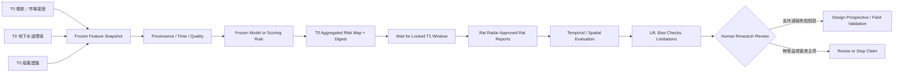
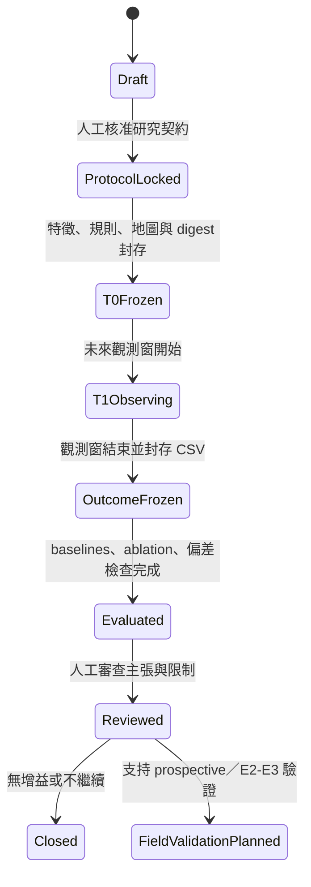

# SubTerrat Harness 架構

> Evidence architecture for Taipei citizen-reported rat-hotspot prediction and later field validation

## 1. 文件定位

本文件定義 SubTerrat 的研究產品架構與 Harness 邊界。第一階段目標是：只使用餐飲／傳統市場密度、地下水道環境與廢棄建築，在 T0 產生臺北聚合區域的結構性風險排序，再以 T1 觀測窗內見鼠雷達審核通過的 `Rat` 通報檢查空間相符程度。此結果只回答「是否預測到民眾見鼠通報熱點」，不直接等於實際鼠群、地下鼠類存在或疾病風險。

本輪只固定研究問題、Evidence contract、T0／T1 驗證與投藥邊界；空間網格大小、模型家族、雲端服務、資料庫與前端框架均延後決定。

本文件同時扮演兩個角色：

1. **研究／產品架構 Guide**：說明 T0 Features、T1 outcome、Evidence、Belief、Decision、Action 與 Feedback 如何維持可稽核邊界。
2. **CoH Harness authority**：提供 routes、Sensors、proof boundaries 與 maintenance triggers 的設計來源；目前已由 `.coh/model.json` 的 `architecture` route 引用，但仍無 repository-owned Sensor，evidence policy 為 `NO_TRUSTED_RESULT`。

### 目前證據狀態

| 狀態 | 內容 |
| --- | --- |
| `OBSERVED` | 見鼠雷達提供 `通報時間、類型、地點、狀態、說明、照片網址、緯度、經度` 的 CSV 匯出，資料不限臺北；主要資料型別包含 `Rat` 與 `Poison`。 |
| `OBSERVED` | 見鼠雷達公開說明採 AI 初篩與志工人工複審；`Approved` 是平台審核狀態，不是專業現場 Ground Truth。 |
| `OBSERVED` | Seattle 研究使用 1,752 個 geotagged manholes 的鼠餌消耗／鼠跡 presence labels 與管線、地表、氣象資料；臺北目前僅把該研究作為地下水道特徵假設來源。 |
| `OBSERVED` | 使用者已選定第一版三組輸入：餐飲區密度（含傳統市場）、地下水道環境、廢棄建築；目標為預測民眾見鼠通報熱點。 |
| `OBSERVED` | 臺北市戶外環境噴藥日程表與抽查的大安區附件只描述戶外環境消毒、水溝與髒亂地區作業，未標示滅鼠餌劑或鼠類防治目的。 |
| `UNKNOWN` | 三組輸入的正式來源、授權、歷史快照、欄位品質、空間解析度與更新頻率尚未確認。 |
| `UNKNOWN` | 第一輪 T0 cutoff、T1 觀測窗、預測區域、聚合網格、成功門檻與通報機會偏差控制尚未鎖定。 |
| `UNKNOWN` | 尚無程式、資料管線、部署環境、測試、CI 或 production evidence。 |

目前 `.coh/model.json` 已引用本文件、`docs/BELIEF.md` 與 `AGENTS.md`，construction status 為 `READY`；但 `sensors=[]` 且 route `sensor_id=null`。因此文件變更有 authority 路由，不代表任何資料、模型或預測已被驗證。

## 2. 中心命題與主張邊界

### 2.1 中心命題

**臺北民眾見鼠通報熱點預測與後續現場驗證研究**

第一階段研究描述：

> SubTerrat 在不使用 T1 見鼠通報調整特徵或權重的條件下，以餐飲／市場密度、地下水道環境與廢棄建築產生 T0 結構性熱點排序；觀測窗結束後，再以見鼠雷達審核通過的臺北 `Rat` 通報評估預測相符程度、基線增益與偏差。

### 2.2 決策單位與輸出

- 分析單位：固定的臺北聚合空間單位；網格或街廓解析度須在實驗封存前決定。
- T0 輸出：各聚合單位的可解釋結構性 score、排名、因素、資料新鮮度與限制。
- T1 outcome：指定觀測窗內，落在臺北範圍、`類型=Rat`、`狀態=Approved` 的見鼠雷達通報。
- 第一輪比較：T0 Top-K／高分區域捕捉到的 T1 通報比例，以及相對餐飲密度單一特徵、人口／通報機會與簡單空間 baseline 的 lift。
- 公開輸出只顯示聚合區域，不顯示完整地下管網、人孔、精確住宅或店家風險。
- 第一階段不產生派工、投藥或其他現場行動建議。

### 2.3 明確非目標

系統不應宣稱或自動執行：

- 預測個人感染漢他病毒或其他疾病。
- 精確估算鼠群數量。
- 把 `Approved` 見鼠通報稱為 E2／E3 現場確認、實際鼠群密度或鼠患 Ground Truth。
- 判定特定店家或住宅「有鼠患」。
- 把單一民眾通報當成 Ground Truth。
- 未經人工核准直接建立 1999 對外案件。
- 自動投藥、封堵、修繕或發布公共衛生警報。
- 預測或建議滅鼠餌劑種類、劑量與投放點。
- 把 Seattle 模型參數直接視為臺北已驗證模型。

## 3. 核心閉環



第一輪必須維持四項分離：

1. **Structural score** 是 T0 三組特徵形成的研究輸出，不是鼠類存在事實。
2. **Reported-sighting outcome** 是 T1 見鼠雷達通報分布，不是實際鼠群 Ground Truth。
3. **Treatment exposure** 是投藥、清疏、封堵或其他介入，不能與結構性風險或鼠類活動混為一談。
4. **Ground Truth** 仍需由未來標準化現場巡檢、捕捉或檢驗取得，不因模型或通報狀態改變。

### 3.1 T0／T1 封存規則

- 在讀取 T1 outcome 前，封存研究問題、臺北邊界、分析單位、三組特徵定義、資料 cutoff、缺值處理、權重／模型、Top-K 規則、baselines、主要指標與停止條件。
- T0 artifact 至少記錄 `generated_at`、資料版本、程式／規則版本、參數與可重算 digest。
- 現有見鼠雷達已被團隊閱讀，只能作 retrospective check；它不能被稱為完全盲化 holdout。
- 第一次 prospective evaluation 必須使用封存時間之後才發生的新通報，且不得在觀測窗中途調權。
- Retrospective、prospective、field-verified 三層結果分開報告，不得互相升格。

## 4. Evidence 架構

### 4.1 證據類別

| 類別 | 候選內容 | 角色 |
| --- | --- | --- |
| T0 結構性先驗 | 餐飲業與傳統市場密度；管線類型、管徑、深度、年代、材質、坡度、海拔與拓撲；廢棄建築 | 形成第一版 feature-only 結構性 score |
| T1 通報 outcome | 見鼠雷達臺北 `Rat + Approved` 通報的時間、位置、說明與可用照片 | 評估通報熱點相符程度；不直接等同實際鼠群標籤 |
| 通報機會／偏差 | 人口、步行活動、土地使用、媒體事件、平台使用變化、資料覆蓋時間 | 檢查模型是否只預測較容易被看見或通報的位置 |
| 疑似介入訊號 | 見鼠雷達 `Poison` 通報 | 低等級 treatment signal；不作主要 outcome 或鼠類活動標籤 |
| 已確認介入 | 具來源、鼠類防治目的、位置、日期與措施類型的投藥、封堵、清疏或修繕 | 作 treatment exposure、分層與敏感度分析 |
| 現場觀測 | 非毒性餌塊消耗、鼠糞、鼠洞、咬痕、捕捉、專業巡檢 | 建立正例與負例 Ground Truth |
| 排除資料 | 未說明藥劑與鼠類防治目的的戶外環境噴藥日程 | 不得推定為滅鼠餌劑或已處理鼠患 |

### 4.2 候選證據等級

| 等級 | 定義 | 可支持的主張 |
| --- | --- | --- |
| `E0` | 無可用照片／影片或獨立交叉訊號的單一民眾見鼠通報；平台狀態可另記 | 存在需要查核的訊號；即使 `Approved` 也不是專業現場確認 |
| `E1` | 具可用照片／影片、多人獨立重複通報或其他交叉訊號 | 活動疑似程度提高，仍非現場確認 |
| `E2` | 專業人員現場確認鼠跡，或依固定程序確認無鼠跡 | 在指定時間與位置的現場觀測 |
| `E3` | 捕捉、實體樣本或實驗室檢驗 | 指定樣本的直接證據；不自動外推為區域疾病風險 |

每筆 Evidence 至少需要：

- `evidence_id`
- `source_type` 與 `source_id`
- 空間範圍與座標系統
- `observed_at`、`ingested_at`、有效時間窗
- 證據等級與品質旗標
- 原始資料版本／雜湊或可追溯引用
- 是否為人類、感測器、模型或系統產生
- 隱私與公開層級
- 是否可作為訓練標籤

### 4.3 見鼠雷達 outcome contract

第一階段主要 outcome 必須同時符合：

- 空間上落在鎖定的臺北研究邊界內，不只依行政區文字判斷。
- `類型=Rat`；`Poison` 分流為疑似介入訊號。
- `狀態=Approved`；`Pending` 不進主要 outcome。
- `通報時間` 落在鎖定的 T1 觀測窗。
- 保存原始 CSV、擷取時間、來源 URL、內容雜湊與欄位版本。
- 聚合後才進入評估；不得在輸出重新暴露精確住宅、照片中的身分資訊或其他不必要細節。

見鼠雷達的 AI＋人工審核可降低部分明顯錯誤與惡意通報，但不能消除未通報區、重複事件、人口與能見度差異，也不能把「沒有通報」解讀成「沒有老鼠」。因此第一階段不使用 accuracy、specificity 或 calibrated probability 等需要可信負標籤的主張。

### 4.4 防止自我強化與 leakage

- 系統產生的任務一律標記 `source=system`。
- 系統任務、模型分數與案件狀態不得作為新的獨立活動證據。
- 1999 或其他民眾通報若是由系統觸發，不得回灌成民眾證據。
- 相同事件的重複資料需做 entity resolution，避免多算。
- 若進入 E2／E3 field validation，訓練資料必須記錄「未發現鼠跡」的負樣本。
- 若進入現場巡檢，配置應保留探索樣本，例如 80% Top-K、20% 隨機或分層抽樣；比例須依資源與研究設計確認。
- T1 見鼠通報及由其衍生的密度、距離或熱區不得進入 T0 feature-only baseline。
- 若日後以較早通報訓練 supervised model，必須另立版本，使用嚴格時間向前 holdout，不得與第一輪文獻先驗實驗混稱。

## 5. Belief 架構

### 5.1 Belief 定義

第一階段 Belief 是特定 T0 資料版本與 scoring rule 下，對聚合空間單位形成的結構性通報熱點 score。它不是事實、案件狀態、鼠群密度或機率。

每個聚合空間單位維護兩項分離紀錄：

1. **Structural Report-Hotspot Belief**：三組 T0 特徵是否形成較高的見鼠通報先驗。
2. **Observed Report Outcome**：T1 觀測窗結束後，該單位實際聚合到的合格見鼠雷達通報；它是 evaluation outcome，不回寫成 T0 特徵。

第一階段只比較 score 排名與 T1 通報分布，不產生 `Inspection Priority`、投藥或派工決策。

### 5.2 候選 Belief record

```json
{
  "belief_id": "belief:<cell_id>:<t0_cutoff>:<model_version>",
  "cell_id": "locked-aggregate-cell-id",
  "t0_cutoff": "RFC3339 timestamp",
  "t1_window": {
    "start": "RFC3339 timestamp",
    "end": "RFC3339 timestamp"
  },
  "model_version": "candidate-model-version",
  "structural_report_hotspot": {
    "score": 0.0,
    "calibrated_probability": null
  },
  "feature_groups": ["food_market_density", "sewer_environment", "abandoned_buildings"],
  "feature_snapshot_refs": [],
  "model_digest": "sha256:...",
  "uncertainty": {
    "method": "UNKNOWN",
    "value": null
  },
  "evidence_refs": [],
  "freshness": "current|stale|unknown",
  "explanation_factors": [],
  "limitations": [],
  "status": "t0_frozen|t1_observing|evaluated",
  "supersedes": null
}
```

在尚未取得臺北 E2／E3 標籤並完成校準前：

- `score` 只能稱為結構性見鼠通報熱點篩選分數。
- `calibrated_probability` 必須為 `null`。
- 不得以「鼠患機率 85%」或「此處確定有鼠」等語句呈現。
- Belief 更新應保留先前版本，不可就地覆寫而失去 provenance。

### 5.3 Belief 更新規則

第一輪概念上：

```text
T0Score = FrozenRule(FoodMarketSnapshot, SewerSnapshot, AbandonedBuildingSnapshot)
T1Outcome = Aggregate(FutureApprovedRatReports, LockedBoundary, LockedWindow)
Evaluation = Compare(T0Score, T1Outcome, Baselines, BiasChecks)
```

候選規則：

- 三組結構特徵形成 T0 prior；T1 通報只用於評估，不在觀測窗中途更新 score。
- 現有通報可用於資料品質探索與 retrospective check，但若已影響規則或權重，必須標記 `development-exposed`。
- 缺資料應增加 uncertainty，不可自動解讀成低風險。
- 互相衝突的證據保留為 `CONFLICTING`，不得任選一方覆蓋。
- 模型版本更換時重算新 Belief record，並保留舊版以供比較。
- T0 封存後不得無痕修改特徵、權重、網格、Top-K 或主要指標。
- 人工可以裁決研究是否繼續，但不能無痕修改模型輸出或 outcome。
- LLM 可協助生成可讀解釋，不得創造 Evidence、調高等級或替代決策規則。

## 6. 研究流程與權限

第一階段是一次可稽核的預測實驗，不以展示 Agent、A2A 或自動化案件流程為目的。任何持續 Agent 或派工工作臺均延後到 prospective 與現場驗證之後再決定。

### 6.1 第一階段可執行與禁止事項

可執行：

- 整合已授權的三組 T0 資料並產生聚合 score。
- 封存資料版本、規則／模型、參數、地圖與 digest。
- 在 T1 關窗後擷取、保存及聚合見鼠雷達 outcome。
- 執行 baselines、ablation、偏差檢查與不確定性報告。
- 產生研究報告與是否進入下一階段的草稿建議。

需人工核准：

- T0 protocol lock 與任何重新封存。
- 成功／失敗判定及是否進入 prospective 或 E2／E3 field validation。
- 對外發布聚合風險地圖與研究主張。
- 任何巡檢、派工、投藥、封堵、修繕或公共衛生升級。

禁止：

- 自動診斷疾病。
- 把通報熱點 score 稱為鼠患 probability、鼠群密度或現場確認。
- 用 T1 outcome 事後調整 T0 實驗，再把結果稱為原模型預測。
- 自動將模型輸出升級為 Ground Truth。
- 未核准即對外通報或指認店家／住宅。
- 自動建議滅鼠藥種類、劑量或投放位置。
- 自動改寫模型 policy、Guide 或 Sensor。

### 6.2 Experiment state machine



狀態轉移必須記錄 actor、時間、資料與模型 digest、前置證據、核准者與 reason code。

## 7. 模型與驗證

### 7.1 候選模型階段

1. **T0 deterministic prior score**：只使用餐飲／市場密度、Seattle 研究支持且通過 data gate 的地下水道環境特徵與廢棄建築，將各 feature 轉成方向固定的 empirical percentile，組內等權、三組各占 `1/3`；不以歷史或 T1 見鼠通報擬合係數。
2. **Retrospective check**：用已存在、且團隊已看過的見鼠雷達資料檢查資料契約、偏差與初步空間相符；結果標記 `development-exposed`，不宣稱盲測。
3. **Prospective report holdout**：封存 T0 後，對未來新通報執行時間向前評估，不在觀測窗中途改模。
4. **Ablation and baseline**：唯一正式 baseline 是 `food-only ranking`；固定比較 Full、Without Food、Without Sewer、Without Abandoned Building，不在看到 T1 後重定義變體。
5. **Field-validation gate**：只有 prospective report-hotspot 結果有增益，才設計 E2／E3 現場正負樣本；通過前不建立 calibrated rat-presence model。

第一版不是 fitted model，不使用 BigQuery ML、Vertex AI、GAM、boosted tree 或自動重訓。這些技術與任何額外 network feature 必須在取得適用標籤、另立 Model card 與時間向前 validation 後再決定。

### 7.2 評估設計

- 以 T0 freeze 之後的新通報做時間向前 holdout，防止 future leakage；第一版沒有 fitted training split，Spatial block split 與留一行政區測試延後到未來 supervised challenger。
- Primary：`Report Capture@K`，即 T0 Top-K／高分聚合區域在 T1 捕捉到的合格通報比例。
- Primary comparator：同一 grid、同一 area budget 的 frozen food-only ranking；同時回報 relative lift 與 absolute capture difference，不得只和隨機結果比較。
- Ablation：餐飲／市場、地下水道、廢棄建築各自與組合模型的增量價值。
- Bias checks：人口、步行／活動強度、行政區、媒體／平台成長與通報機會敏感度。
- 投藥敏感度：只有取得可信的鼠類防治 exposure 後，才比較介入前後或分層結果；不得用疑似投藥通報推定實際處置。
- 第一階段沒有可信負標籤，不報 accuracy、specificity、PR-AUC 或 calibrated probability。
- 所有 retrospective、prospective 與未來 E2／E3 field results 分層報告。

通報熱點相符不能替代實際鼠類活動或城市營運成效。即使第一階段成功，主張上限仍是「三組 T0 特徵對未來見鼠雷達通報分布具有時間向前的排序增益」。

### 7.3 v0.1 prediction output contract

- 分析單位固定為臺北研究邊界裁切後的 S2 Level 15 cell；`cell_id` 以 string 保存。
- 主 ranking 由 Food、Sewer、Abandoned 三組等權平均；正式 baseline 是 Food-only。
- 固定輸出 Full、Food-only、Without Food、Without Sewer、Without Abandoned Building ranks。
- Primary Top-K 為臺北 eligible area 前 10%；5% 與 20% 只作預先登錄 sensitivity。
- 每筆輸出必須綁定 `prediction_run_id`、`issued_at`、`as_of`、target window、feature snapshot、model version／digest 與 freeze lineage。
- `structural_score` 是 ranking score；`calibrated_probability` 固定為 `null`。
- 多次 prediction runs 形成 forecast-vintage history；不得把單一 window score 展開成虛構的 daily time series。

Machine-readable transport projection 位於 `docs/openapi-v1.yaml`，完整欄位、endpoint、storage mapping 與 deferred capability 說明位於 `docs/API_CONTRACT.md`。兩者是本節的 subordinate contract；衝突時以 `docs/BELIEF.md` 與本文件為準。OpenAPI 可被 FastAPI 採用，不代表 endpoint、model artifact、runtime 或 deployment 已存在。

## 8. 資料、介面與治理邊界

### 8.1 三個視圖

- **T0 結構性 score 層**：餐飲／市場密度、地下水道環境、廢棄建築及其資料新鮮度。
- **T1 通報 outcome 層**：聚合後的見鼠雷達 `Rat + Approved` 通報；與 `Pending`、`Poison` 分開。
- **介入與偏差層**：可信投藥／封堵／清疏紀錄、疑似投藥訊號、人口與通報機會等敏感度資訊。

### 8.2 內外部分離

| 介面 | 可見內容 |
| --- | --- |
| 內部研究工作臺 | 原始來源 refs、聚合前暫存資料、T0／T1 cutoff、score、baselines、偏差檢查與稽核紀錄 |
| 公開研究地圖 | 聚合網格／街廓、score 分級、資料更新時間、研究限制；不稱實際鼠患機率 |

### 8.3 敏感資料

- 通報人身分、GPS、人臉、車牌、門牌與住宅精確位置需去識別化與最小化。
- 地下基礎設施細節需依角色授權，公開圖層不得暴露完整管網。
- 特定店家與住宅不可因未驗證 Belief 被公開標記。
- 所有模型版本、操作、人工否決、派工、狀態轉移與資料存取應可稽核。

## 9. Harness 設計

以下均為候選控制，尚未在 repository 中實作或啟用。

### 9.1 Proposed Guides

| Guide | 目的 | 建議擁有者 |
| --- | --- | --- |
| 本文件 | 研究目標、Belief、outcome、投藥與證據邊界 | Product／Architecture owner |
| Experiment protocol | T0／T1 cutoff、網格、baselines、指標、停止條件與封存程序 | Research owner |
| Data contract | 三組 T0 特徵、見鼠雷達 outcome、偏差與介入欄位 | Data owner |
| Model card | 目標、資料、切分、ablation、限制與 development exposure | Model owner |
| Public disclosure policy | 內外部圖層與風險溝通 | Governance owner |

### 9.2 Proposed CoH routes

| Route ID | 路由範圍 | Authority |
| --- | --- | --- |
| `architecture` | 研究目標、Belief、決策、權限與跨模組變更 | 本文件 |
| `data` | ingestion、schema、quality、privacy | 未來 Data contract |
| `model` | features、training、evaluation、calibration | 未來 Model card |
| `operations` | case、inspection、intervention、audit | 未來 Operations runbook |
| `ui` | internal workbench、public map | 本文件＋未來 disclosure policy |

CoH runtime 只應使用 exact `[route:<id>]` 或宣告的 path prefix；不得以語意關鍵字猜測 route。

### 9.3 Proposed Sensors

| Sensor | 控制等級 | Proof layer | 證明 | 不證明 |
| --- | --- | --- | --- | --- |
| Evidence schema validator | hard gate | `static` | 必填 provenance、時間、等級與隱私欄位存在 | 資料真實或正確 |
| Belief provenance validator | hard gate | `static` | Belief 引用存在的 Evidence 與 model version | 分數校準或決策有效 |
| Rat Radar outcome contract | hard gate | `static`／`runtime` | 只納入鎖定邊界、時間、`Rat + Approved`，並分流 `Pending`／`Poison` | 通報為 E2／E3 或沒有 selection bias |
| T0 artifact digest | hard gate | `runtime` | 特徵快照、規則／模型、地圖與指標在 T1 前已封存且未變 | 預測具有外部效度 |
| Spatial／temporal leakage tests | hard gate | `runtime` | T1 通報及其衍生欄位未進入 T0，指定切分沒有已知洩漏 | 未知的人為調參或所有偏差已消除 |
| Intervention-purpose validator | hard gate | `static` | 只有具鼠類防治目的、位置與時間的措施可列 treatment exposure | 投藥有效或因果效果成立 |
| Report-hotspot evaluation | report-only | `runtime`／`human-review` | 指定 T1 視窗的 Capture@K、baseline lift、ablation 與偏差檢查 | 實際鼠群存在、鼠患機率或治理成效 |
| Internal/public layer policy test | hard gate | `static`／`browser` | 指定欄位未出現在公開 build／journey | 所有角色、部署與旁路皆安全 |
| Experiment state transition test | hard gate | `runtime` | 缺少 protocol lock、digest 或人工 review 時不能宣告完成 | 研究問題本身正確 |

### 9.4 Feedforward 與 feedback

Feedforward：

- 進入模組前路由到最小 authority。
- 明確非目標與人機權限邊界。
- T0 Features、T1 outcome、treatment exposure 與 Ground Truth 的資料契約。
- 公開／內部資料分級。

Feedback：

- Retrospective 與 prospective outcome 分層回流。
- Sensor receipts 與 CI 結果。
- Capture@K、baseline lift、ablation 與 bias checks。
- 取得 E2／E3 後的 field validation 與失敗案例 review。
- 只有經人工 review 的重複失敗，才提議更新 Guide、測試或 ratchet。

## 10. Proof boundaries

| 層級 | 本專案候選證據 | 主張上限 |
| --- | --- | --- |
| `static` | schema、route、欄位、policy 與 source exclusion 檢查 | 檔案／結構符合宣告 |
| `runtime` | ETL、T0 freeze、T1 aggregation、leakage 與 report-hotspot KPI | 指定環境、資料、版本與觀測窗的執行結果 |
| `browser` | 內部工作臺／公開地圖的指定角色 journey | 被測 build 與角色的 UI 行為 |
| `live-provider` | 見鼠雷達 CSV、臺北資料來源或其他真實 provider | 指定 URL、擷取時間與內容版本的 provider 行為 |
| `production` | 未來部署版本的 canary；第一階段無 production evidence | 指定版本與時間窗的 narrow live evidence |
| `human-review` | 公衛、維運、隱私與產品評審 | 語意與風險判斷，不取代 deterministic tests |

文件、模型 metadata 或助手文字都不是 validation receipt。任何「有效」「可用」「已改善」的主張必須指向相同 layer 的直接證據。

## 11. 研究與產品階段

### Phase 0 — Research contract 與資料可行性

- 確認臺北研究邊界、聚合單位、T0 cutoff、T1 觀測窗、Top-K、baselines、主要指標與停止條件。
- 取得餐飲／市場、地下水道、廢棄建築的來源、授權、歷史快照、座標系統與品質樣本。
- 確認見鼠雷達 CSV 的使用條件、保存方式、欄位版本與更新行為。
- 定義 treatment exposure、疑似 `Poison` 訊號、通報機會偏差與排除規則。

### Phase 1 — T0 封存與 retrospective check

- 建立只含三組特徵的文獻先驗 baseline。
- 顯示 score、因素、資料新鮮度與限制，不稱為 probability。
- 封存特徵、規則／模型、地圖、baselines、指標與 digest。
- 用已被團隊看過的現有通報執行 `development-exposed` retrospective check，不宣稱盲測。

### Phase 2 — Prospective report holdout

- 在封存後開啟新的 T1 觀測窗，中途不得改模。
- 關窗後保存見鼠雷達 CSV 與 digest，只聚合 `Taipei + Rat + Approved`。
- 執行 Capture@K、baseline lift、ablation、bias checks 與可信投藥 exposure 敏感度分析。

### Phase 3 — E2／E3 field-validation gate

- 若 prospective 通報熱點結果有增益，才定義標準化現場正負樣本與巡檢 protocol。
- 以 Top-K、簡單 baseline 與探索樣本比較 verified yield。
- 只有在地 E2／E3 標籤與 calibration 通過後，才討論 rat-presence probability。

### Phase 4 — 決策產品與真實整合

- 再決定是否建立巡檢工作臺、Agent、派工或 provider 整合。
- 投藥、封堵、修繕與公共衛生行動持續需要人類及權責單位核准。
- 在有明確權責、獨立狀態與訊息契約後，才評估 A2A 或其他技術框架。

## 12. 必須先回答的決策

已決定：第一階段預測「未來見鼠雷達審核通過的臺北 `Rat` 通報熱點」；T0 只使用餐飲／傳統市場密度、地下水道環境與廢棄建築；現有地圖只作 retrospective check；投藥只作可信 treatment exposure，不作標籤或自動行動。

實作前仍須回答：

1. 臺北研究邊界、聚合網格／街廓與 Top-K 面積是多少？
2. T0 cutoff 與第一個 prospective T1 觀測窗多長？
3. 三組特徵各自採哪個 authority source、歷史版本、定義與缺值規則？
4. 見鼠雷達資料的授權、版本保存與刪改紀錄契約為何？
5. 人口、步行活動、平台成長與媒體注意等通報機會偏差如何控制？
6. 成功門檻與 baselines 為何，什麼結果會停止或改寫題目？
7. 是否能取得真正鼠類防治的投藥／封堵／清疏點位、日期與措施類型？
8. 若通報熱點實驗成功，E2／E3 field validation 由誰執行與核准？
9. 研究展示、真實市府試辦與技術框架的選擇均留待上述契約完成後決定。

在這些問題未回答前，架構只支持研究契約與原型；即使 prospective 通報熱點相符，也不能支持「臺北實際鼠患預測系統已驗證」、投藥建議或「Agent 已可自動派工」的主張。

## 13. Maintenance triggers

下列事件發生時必須重新 review 本文件與未來 Harness Model：

- 目標、時間窗、分析單位或正式使用者改變。
- 新增 Evidence 類別、標籤來源或公開資料欄位。
- T0／T1 cutoff、見鼠雷達 outcome contract、baselines 或成功門檻改變。
- 模型版本、決策 policy、探索比例或校準方法改變。
- Agent 權限、人工核准點或狀態機改變。
- 新增真實 provider、production deployment 或跨局處整合。
- 發現 privacy、infrastructure security、feedback contamination 或 selection bias 事件。
- Sensor 出現重複 false positive／false negative，或 proof boundary 被誤述。

維護原則：先保留 live authority 與原始 Evidence，再更新引用與關係；不得為了讓文件看起來一致而覆寫衝突或未確定事實。

## 14. 參考來源

- ChatGPT Pro 對 SubTerrat／DevJam 心智圖的架構評審，讀取日期：2026-08-17。
- [Characteristics of the urban sewer system and rat presence in Seattle](https://www.researchgate.net/publication/361570415_Characteristics_of_the_urban_sewer_system_and_rat_presence_in_Seattle)：科學假設來源，不是臺北在地有效性的證明。
- [Seattle 研究公開資料與方法](https://datadryad.org/dataset/doi:10.5061/dryad.mw6m90603)：1,752 個 geotagged manholes 的 presence labels、管線、人孔、地表與氣象資料說明。
- [見鼠雷達通報清單](https://ratdar.taipei/reports)：第一階段 T1 outcome 候選來源，包含 CSV 匯出；資料會持續更新且不限臺北。
- [見鼠雷達審核透明度報告](https://ratdar.taipei/transparency)：AI 初篩、人工複審、退件原因與更新時間說明；平台審核不等於 E2／E3。
- [臺北市戶外環境噴藥日程表](https://www.dep.gov.taipei/News_Content.aspx?n=C9DDE466083DD04F&sms=0643EAEB0A6AB30F&s=1136ABBCE065A121)：一般戶外環境消毒日程；未提供滅鼠餌劑用途證據，故不列鼠類投藥資料。
- [環境部鼠害防治投放與綜合管理原則](https://enews.moenv.gov.tw/moenv-news/zh-tw/News/13612)：投藥僅為輔助，須定點投放、記錄地點與數量、收回未食餌並防止非目標風險。
- CoH `0.3.0-alpha.3` bundled Harness concepts、control selection 與 proof-boundary contracts。
