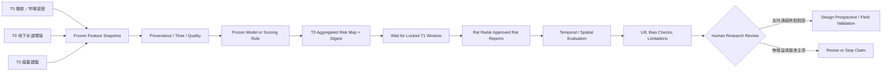
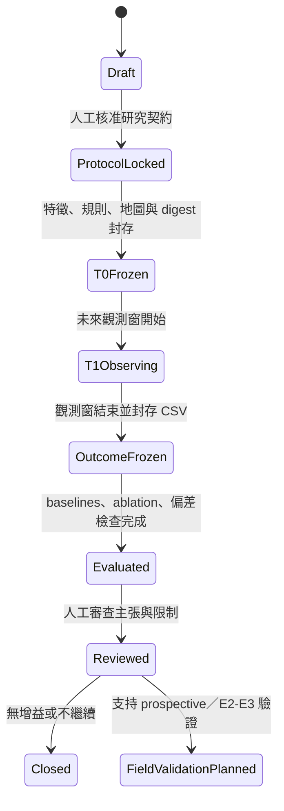
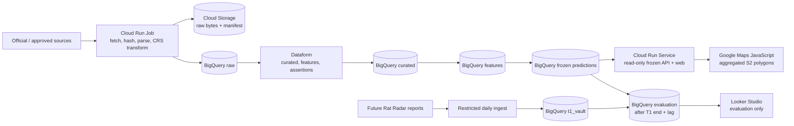

# SubTerrat Harness 架構

> Evidence architecture for Taipei citizen-reported rat-hotspot prediction and later field validation

## 1. 文件定位

本文件定義 SubTerrat 的研究產品架構與 Harness 邊界。第一階段目標是：只使用餐飲／傳統市場密度、地下水道環境與廢棄建築，在 T0 產生臺北聚合區域的結構性風險排序，再以 T1 觀測窗內見鼠雷達審核通過的 `Rat` 通報檢查空間相符程度。此結果只回答「是否預測到民眾見鼠通報熱點」，不直接等於實際鼠群、地下鼠類存在或疾病風險。

本文件現已進入 v0.1 implementation specification：研究問題、Evidence contract、T0／T1 驗證與投藥邊界維持不變，並鎖定第一版分析單位、ranking rule、baseline、主要指標與最小 Google-native 架構。這些選擇仍須通過資料可行性 gate；通過 gate、部署成功或產出地圖都不會把狀態升格為已驗證預測。

本文件同時扮演兩個角色：

1. **研究／產品架構 Guide**：說明 T0 Features、T1 outcome、Evidence、Belief、Decision、Action 與 Feedback 如何維持可稽核邊界。
2. **CoH Harness authority**：提供 routes、Sensors、proof boundaries 與 maintenance triggers 的設計來源；目前已由 `.coh/model.json` 的 `architecture` route 引用，但仍無 repository-owned Sensor，evidence policy 為 `NO_TRUSTED_RESULT`。

### 目前證據狀態

| 狀態 | 內容 |
| --- | --- |
| `OBSERVED` | 見鼠雷達提供 `通報時間、類型、地點、狀態、說明、照片網址、緯度、經度` 的 CSV 匯出，資料不限臺北；主要資料型別包含 `Rat` 與 `Poison`。 |
| `OBSERVED` | 見鼠雷達公開說明採 AI 初篩與志工人工複審；`Approved` 是平台審核狀態，不是專業現場 Ground Truth。 |
| `OBSERVED` | Seattle 研究使用 1,752 個 geotagged manholes 的鼠餌消耗／鼠跡 presence labels 與管線、地表、氣象資料；臺北目前僅把該研究作為地下水道特徵假設來源。 |
| `OBSERVED` | 使用者已選定第一版三組輸入：餐飲區密度（含傳統市場）、地下水道環境、廢棄建築；目標為預測民眾見鼠通報熱點。 |
| `OBSERVED` | 臺北資料大平臺 API 的候選污水資料包含人孔、陰井與巷弄連接管；另有雨水人孔、雨水 KML／XML 管線資料。污水與雨水是不同 source system，不得因雨水欄位較完整而互相替代。 |
| `OBSERVED` | 2026-08-17 抽查六個 resource ID：四個 JSON resource 有資料，一個 XML resource 不適用 record API，一個 KML resource 由下載端點提供；resource 可呼叫不等於 citywide coverage、語義或模型適用性已通過。 |
| `OBSERVED` | 臺北資料大平臺現有 20,241 筆餐館業登記、48 筆傳統市（商）場及 47 筆攤販集中場候選點位；基本鍵值與座標檢查通過，但登記不證明現場仍營業，市場代表點也不是 footprint 或攤位母體。 |
| `OBSERVED` | 「臺北市市有尚未利用建物供給資料清冊」只有 19 筆、無來源座標，且定義只涵蓋市有尚未利用建物；可作 scope-limited candidate，不能代表臺北市所有廢棄建築。 |
| `OBSERVED` | 臺北市戶外環境噴藥日程表與抽查的大安區附件只描述戶外環境消毒、水溝與髒亂地區作業，未標示滅鼠餌劑或鼠類防治目的。 |
| `UNKNOWN` | 餐飲／市場尚未 materialize 為版本化 cell density 或完成現行營業語義與 95% coverage gate；「廢棄建築」仍缺 citywide、具一致狀態時間與可定位的權威來源。污水人孔／陰井的正式 CRS 宣告、點位完整性與部分欄位語義仍待確認；Seattle-aligned 的管徑、管線深度與管線年代還需要權威管線來源及可稽核的 node-edge join。 |
| `UNKNOWN` | 第一輪 T0 cutoff、T1 實際起訖、見鼠雷達保存／再利用條件、通報機會資料與統計 power 尚未鎖定。 |
| `OBSERVED` | BigQuery 已有 raw／curated candidate、來源／input／outcome contract 與 readiness views；這些是瀏覽器建立並以 provider row count／schema 稽核的 Operational State。尚無 repository-owned ingestion code、Sensor、CI、deployment 或 production evidence。 |

目前 `.coh/model.json` 已引用本文件、`docs/BELIEF.md` 與 `AGENTS.md`，construction status 為 `READY`；但 `sensors=[]` 且 route `sensor_id=null`。因此文件變更有 authority 路由，不代表任何資料、模型或預測已被驗證。

## 2. 中心命題與主張邊界

### 2.1 中心命題

**臺北民眾見鼠通報熱點預測與後續現場驗證研究**

第一階段研究描述：

> SubTerrat 只研究臺北市。在不使用 T1 見鼠通報調整特徵或權重的條件下，以餐飲／市場密度、地下水道人孔／陰井 access-point proxy 與廢棄建築產生 T0 結構性熱點排序；觀測窗結束後，再以見鼠雷達審核通過、且座標落在鎖定臺北邊界內的 `Rat` 通報評估 Capture、基線增益與偏差。

### 2.2 決策單位與輸出

- 分析單位：臺北研究邊界裁切後的固定 S2 Level 15 cell；`grid_version`、邊界版本與 cell polygon digest 必須在 T0 封存。
- T0 輸出：各聚合單位的可解釋結構性 score、排名、因素、資料新鮮度與限制。
- T1 outcome：指定觀測窗內，落在臺北範圍、`類型=Rat`、`狀態=Approved` 的見鼠雷達通報。
- 第一輪 primary K：依 frozen score 排序後涵蓋臺北 eligible area 前 10% 的 cells；5% 與 20% 只作預先登錄的 sensitivity。
- 第一輪正式 baseline：只含餐飲／傳統市場的 `food-only ranking`。人口、步行活動、平台成長與媒體注意只作 bias stratification，不進 T0 score 或正式 baseline。
- 公開輸出只顯示聚合區域，不顯示完整地下管網、人孔、精確住宅或店家風險。
- 第一階段不產生派工、投藥或其他現場行動建議。

### 2.3 明確非目標

系統不應宣稱或自動執行：

- 預測個人感染漢他病毒或其他疾病。
- 精確估算鼠群數量。
- 把 `Approved` 見鼠通報稱為 E2／E3 現場確認、實際鼠群密度或鼠患 Ground Truth。
- 判定特定店家或住宅「有鼠患」。
- 把單一民眾通報當成 Ground Truth。
- 未經人工核准直接建立 1999 對外案件。
- 自動投藥、封堵、修繕或發布公共衛生警報。
- 預測或建議滅鼠餌劑種類、劑量與投放點。
- 把 Seattle 模型參數直接視為臺北已驗證模型。

## 3. 核心閉環



第一輪必須維持四項分離：

1. **Structural score** 是 T0 三組特徵形成的研究輸出，不是鼠類存在事實。
2. **Reported-sighting outcome** 是 T1 見鼠雷達通報分布，不是實際鼠群 Ground Truth。
3. **Treatment exposure** 是投藥、清疏、封堵或其他介入，不能與結構性風險或鼠類活動混為一談。
4. **Ground Truth** 仍需由未來標準化現場巡檢、捕捉或檢驗取得，不因模型或通報狀態改變。

### 3.1 T0／T1 封存規則

- 在讀取 T1 outcome 前，封存研究問題、臺北邊界、分析單位、三組特徵定義、資料 cutoff、缺值處理、權重／模型、Top-K 規則、baselines、主要指標與停止條件。
- T0 artifact 至少記錄 `generated_at`、資料版本、程式／規則版本、參數與可重算 digest。
- 現有見鼠雷達已被團隊閱讀，只能作 retrospective check；它不能被稱為完全盲化 holdout。
- Retrospective check 只用來驗證資料管線、空間對齊與明顯失效；不得以肉眼判斷 T0 地圖「長得像」目前見鼠雷達作為成功標準，也不得依目前通報重調 feature、方向或權重後仍稱為原始預測。
- 第一次 prospective evaluation 必須使用封存時間之後才發生的新通報，且不得在觀測窗中途調權。
- Retrospective、prospective、field-verified 三層結果分開報告，不得互相升格。

## 4. Evidence 架構

### 4.1 證據類別

| 類別 | 候選內容 | 角色 |
| --- | --- | --- |
| T0 結構性先驗 | 餐飲業與傳統市場密度；以臺北人孔／陰井作 join unit 的 Seattle-aligned 地下水道特徵（系統類型、高程、相連管線深度、管徑、年代）；廢棄建築 | 形成第一版 feature-only 結構性 score；只有通過 data gate 的論文支持特徵可進分數 |
| T1 通報 outcome | 見鼠雷達臺北 `Rat + Approved` 通報的時間、位置、說明與可用照片 | 評估通報熱點相符程度；不直接等同實際鼠群標籤 |
| 通報機會／偏差 | 人口、步行活動、土地使用、媒體事件、平台使用變化、資料覆蓋時間 | 檢查模型是否只預測較容易被看見或通報的位置 |
| 疑似介入訊號 | 見鼠雷達 `Poison` 通報 | 低等級 treatment signal；不作主要 outcome 或鼠類活動標籤 |
| 已確認介入 | 具來源、鼠類防治目的、位置、日期與措施類型的投藥、封堵、清疏或修繕 | 作 treatment exposure、分層與敏感度分析 |
| 現場觀測 | 非毒性餌塊消耗、鼠糞、鼠洞、咬痕、捕捉、專業巡檢 | 建立正例與負例 Ground Truth |
| 排除資料 | 未說明藥劑與鼠類防治目的的戶外環境噴藥日程 | 不得推定為滅鼠餌劑或已處理鼠患 |

### 4.2 候選證據等級

| 等級 | 定義 | 可支持的主張 |
| --- | --- | --- |
| `E0` | 無可用照片／影片或獨立交叉訊號的單一民眾見鼠通報；平台狀態可另記 | 存在需要查核的訊號；即使 `Approved` 也不是專業現場確認 |
| `E1` | 具可用照片／影片、多人獨立重複通報或其他交叉訊號 | 活動疑似程度提高，仍非現場確認 |
| `E2` | 專業人員現場確認鼠跡，或依固定程序確認無鼠跡 | 在指定時間與位置的現場觀測 |
| `E3` | 捕捉、實體樣本或實驗室檢驗 | 指定樣本的直接證據；不自動外推為區域疾病風險 |

每筆 Evidence 至少需要：

- `evidence_id`
- `source_type` 與 `source_id`
- 空間範圍與座標系統
- `observed_at`、`ingested_at`、有效時間窗
- 證據等級與品質旗標
- 原始資料版本／雜湊或可追溯引用
- 是否為人類、感測器、模型或系統產生
- 隱私與公開層級
- 是否可作為訓練標籤

### 4.3 見鼠雷達 outcome contract

第一階段主要 outcome 必須同時符合：

- 空間上落在鎖定的臺北研究邊界內，不只依行政區文字判斷。
- `類型=Rat`；`Poison` 分流為疑似介入訊號。
- `狀態=Approved`；`Pending` 不進主要 outcome。
- `通報時間` 落在鎖定的 T1 觀測窗。
- 保存原始 CSV、擷取時間、來源 URL、內容雜湊與欄位版本。
- 聚合後才進入評估；不得在輸出重新暴露精確住宅、照片中的身分資訊或其他不必要細節。

見鼠雷達的 AI＋人工審核可降低部分明顯錯誤與惡意通報，但不能消除未通報區、重複事件、人口與能見度差異，也不能把「沒有通報」解讀成「沒有老鼠」。因此第一階段不使用 accuracy、specificity 或 calibrated probability 等需要可信負標籤的主張。

### 4.4 防止自我強化與 leakage

- 系統產生的任務一律標記 `source=system`。
- 系統任務、模型分數與案件狀態不得作為新的獨立活動證據。
- 1999 或其他民眾通報若是由系統觸發，不得回灌成民眾證據。
- 相同事件的重複資料需做 entity resolution，避免多算。
- 若進入 E2／E3 field validation，訓練資料必須記錄「未發現鼠跡」的負樣本。
- 若進入現場巡檢，配置應保留探索樣本，例如 80% Top-K、20% 隨機或分層抽樣；比例須依資源與研究設計確認。
- T1 見鼠通報及由其衍生的密度、距離或熱區不得進入 T0 feature-only baseline。
- 若日後以較早通報訓練 supervised model，必須另立版本，使用嚴格時間向前 holdout，不得與第一輪文獻先驗實驗混稱。

## 5. Belief 架構

### 5.1 Belief 定義

第一階段 Belief 是特定 T0 資料版本與 scoring rule 下，對聚合空間單位形成的結構性通報熱點 score。它不是事實、案件狀態、鼠群密度或機率。

每個聚合空間單位維護兩項分離紀錄：

1. **Structural Report-Hotspot Belief**：三組 T0 特徵是否形成較高的見鼠通報先驗。
2. **Observed Report Outcome**：T1 觀測窗結束後，該單位實際聚合到的合格見鼠雷達通報；它是 evaluation outcome，不回寫成 T0 特徵。

第一階段只比較 score 排名與 T1 通報分布，不產生 `Inspection Priority`、投藥或派工決策。

### 5.2 候選 Belief record

```json
{
  "belief_id": "belief:<cell_id>:<t0_cutoff>:<model_version>",
  "cell_id": "locked-aggregate-cell-id",
  "t0_cutoff": "RFC3339 timestamp",
  "t1_window": {
    "start": "RFC3339 timestamp",
    "end": "RFC3339 timestamp"
  },
  "model_version": "candidate-model-version",
  "structural_report_hotspot": {
    "score": 0.0,
    "calibrated_probability": null
  },
  "feature_groups": ["food_market_density", "sewer_environment", "abandoned_buildings"],
  "feature_snapshot_refs": [],
  "model_digest": "sha256:...",
  "uncertainty": {
    "method": "UNKNOWN",
    "value": null
  },
  "evidence_refs": [],
  "freshness": "current|stale|unknown",
  "explanation_factors": [],
  "limitations": [],
  "status": "t0_frozen|t1_observing|evaluated",
  "supersedes": null
}
```

在尚未取得臺北 E2／E3 標籤並完成校準前：

- `score` 只能稱為結構性見鼠通報熱點篩選分數。
- `calibrated_probability` 必須為 `null`。
- 不得以「鼠患機率 85%」或「此處確定有鼠」等語句呈現。
- Belief 更新應保留先前版本，不可就地覆寫而失去 provenance。

### 5.3 Belief 更新規則

第一輪概念上：

```text
T0Score = FrozenRule(FoodMarketSnapshot, SewerSnapshot, AbandonedBuildingSnapshot)
T1Outcome = Aggregate(FutureApprovedRatReports, LockedBoundary, LockedWindow)
Evaluation = Compare(T0Score, T1Outcome, Baselines, BiasChecks)
```

候選規則：

- 三組結構特徵形成 T0 prior；T1 通報只用於評估，不在觀測窗中途更新 score。
- 現有通報可用於資料品質探索與 retrospective check，但若已影響規則或權重，必須標記 `development-exposed`。
- 缺資料應增加 uncertainty，不可自動解讀成低風險。
- 互相衝突的證據保留為 `CONFLICTING`，不得任選一方覆蓋。
- 模型版本更換時重算新 Belief record，並保留舊版以供比較。
- T0 封存後不得無痕修改特徵、權重、網格、Top-K 或主要指標。
- 人工可以裁決研究是否繼續，但不能無痕修改模型輸出或 outcome。
- LLM 可協助生成可讀解釋，不得創造 Evidence、調高等級或替代決策規則。

## 6. 研究流程與權限

第一階段是一次可稽核的預測實驗，不以展示 Agent、A2A 或自動化案件流程為目的。任何持續 Agent 或派工工作臺均延後到 prospective 與現場驗證之後再決定。

### 6.1 第一階段可執行與禁止事項

可執行：

- 整合已授權的三組 T0 資料並產生聚合 score。
- 封存資料版本、規則／模型、參數、地圖與 digest。
- 在 T1 關窗後擷取、保存及聚合見鼠雷達 outcome。
- 執行 baselines、ablation、偏差檢查與不確定性報告。
- 產生研究報告與是否進入下一階段的草稿建議。

需人工核准：

- T0 protocol lock 與任何重新封存。
- 成功／失敗判定及是否進入 prospective 或 E2／E3 field validation。
- 對外發布聚合風險地圖與研究主張。
- 任何巡檢、派工、投藥、封堵、修繕或公共衛生升級。

禁止：

- 自動診斷疾病。
- 把通報熱點 score 稱為鼠患 probability、鼠群密度或現場確認。
- 用 T1 outcome 事後調整 T0 實驗，再把結果稱為原模型預測。
- 自動將模型輸出升級為 Ground Truth。
- 未核准即對外通報或指認店家／住宅。
- 自動建議滅鼠藥種類、劑量或投放位置。
- 自動改寫模型 policy、Guide 或 Sensor。

### 6.2 Experiment state machine



狀態轉移必須記錄 actor、時間、資料與模型 digest、前置證據、核准者與 reason code。

## 7. 模型與驗證

### 7.1 候選模型階段

1. **T0 deterministic prior score**：三組特徵各自轉為方向固定的 empirical percentile，組內等權、三組各占 `1/3`；不以歷史或 T1 見鼠通報擬合係數。
2. **Retrospective check**：用已存在、且團隊已看過的見鼠雷達資料檢查資料契約、偏差與初步空間相符；結果標記 `development-exposed`，不宣稱盲測。
3. **Prospective report holdout**：封存 T0 後，對未來新通報執行時間向前評估，不在觀測窗中途改模。
4. **Baseline and ablation**：唯一正式 baseline 是 `food-only ranking`；固定比較 Full、Without Food、Without Sewer、Without Abandoned Building，不在看到 T1 後重定義變體。
5. **Field-validation gate**：只有 prospective report-hotspot 結果有增益，才設計 E2／E3 現場正負樣本；通過前不建立 calibrated rat-presence model。

第一版不使用 BigQuery ML、Vertex AI、GAM、boosted tree、NetworkX global centrality 或自動重訓。地下水道 feature set 僅限 Seattle 研究明確支持的系統類型、高程、管線深度、管徑與管線年代；人孔／陰井只作定位與 node-edge join unit。不得加入人孔密度、最近人孔距離、local degree、junction density、dead-end density 或其他論文未支持的 proxy，也不得把人孔端點連成的 chord 宣稱為權威地下管線路徑。

### 7.2 評估設計

- 以 T0 freeze 之後的新通報做時間向前 holdout，防止 future leakage；第一版沒有 fitted training split，Spatial block split 與留一行政區測試延後到未來 supervised challenger。
- Primary：`Report Capture@10% area`，即 frozen score 選出的臺北 eligible area 前 10% cells 捕捉到的合格 T1 通報比例。
- Primary comparator：同一 grid、同一 10% area budget 的 frozen food-only ranking；同時回報 relative lift 與 absolute `Delta Capture`，不得只和隨機結果比較。
- Ablation：餐飲／市場、地下水道、廢棄建築各自與組合模型的增量價值。
- Bias checks：人口、步行／活動強度、行政區、媒體／平台成長與通報機會敏感度。
- 投藥敏感度：只有取得可信的鼠類防治 exposure 後，才比較介入前後或分層結果；不得用疑似投藥通報推定實際處置。
- 第一階段沒有可信負標籤，不報 accuracy、specificity、PR-AUC 或 calibrated probability。
- 若 T1 的合格通報量不足以支持預註冊的最小增益判定，結果標為 `INCONCLUSIVE`，不得把寬信賴區間解讀為成功或失敗。
- 所有 retrospective、prospective 與未來 E2／E3 field results 分層報告。

通報熱點相符不能替代實際鼠類活動或城市營運成效。即使第一階段成功，主張上限仍是「三組 T0 特徵對未來見鼠雷達通報分布具有時間向前的排序增益」。

### 7.3 v0.1 ranking specification

#### 分析網格與 Top-K

- `grid_system = S2`
- `s2_level = 15`
- 邊界 cell 以臺北研究邊界裁切，所有密度與 Top-K 面積使用 `eligible_area_m2`。
- Primary K 為臺北 eligible area 的 10%。依 score 降序累積完整 cell，跨過 10% 的最後一格仍整格納入，並回報實際 selected area fraction。
- 5% 與 20% 只作 sensitivity；不得在讀取 T1 後更換 primary K。
- score 相同時固定以 `cell_id` 排序，確保重跑結果一致。

#### 主 score

對每個通過 field catalog gate 的 feature `f`，依預先登錄方向轉成 T0 eligible cells 中的 empirical percentile `r_f(c)`。每組內等權：

```text
Food(c)      = mean(rank_percentile(food features))
Sewer(c)     = mean(rank_percentile(sewer features))
Abandoned(c) = mean(rank_percentile(abandoned-building features))

MainScore(c) = (Food(c) + Sewer(c) + Abandoned(c)) / 3
Baseline(c)  = Food(c)
```

約束：

- 三組固定各占 `1/3`；Seattle 文獻只決定 feature eligibility、方向與必要 transformation，不搬用 Seattle 係數。
- 缺資料只有在來源明確為完整名冊，且「沒有紀錄」確實代表零時才可填 0。
- 任一 group coverage 未知時，該 cell 不進 main eligible set；不得動態重新正規化剩餘 group 權重。
- `score` 是 ranking score，不得命名為 `probability`、`likelihood`、`rat_presence` 或 `abundance`。
- 固定 ablation 為 Full、Without Food、Without Sewer、Without Abandoned Building；ablation 不重新擬合。

#### Primary metric

```text
Capture@10% =
  number of eligible T1 Approved Rat reports inside frozen top-10%-area cells
  / number of all eligible T1 Approved Rat reports inside Taipei

Lift@10% = Capture_full@10% / Capture_food_only@10%
DeltaCapture@10% = Capture_full@10% - Capture_food_only@10%
```

Denominator 必須包含落在 feature 缺漏／無法計分 cell 的合格通報，並另報 `unscored_outcome_fraction`；不得透過排除未計分 outcome 美化 capture。

### 7.4 Data feasibility gate

在建立 citywide 三組 score 前，每組至少要證明：

1. 有可保存原始位元組、授權文字／URI、擷取時間與 SHA-256 的來源。
2. 欄位語義與研究構念一致；雨水、污水、巷弄連接管、人孔與陰井不可靜默合併。
3. 座標系統已確認，原始座標與 `source_crs` 保留；非 WGS84 必須以固定 transformation version 轉換。
4. 資料有效時間早於 T0 cutoff，且能重建當時版本。
5. 可計分面積至少涵蓋臺北 eligible area 的 95%；超過 5% 面積需要未知值填補時不得 freeze citywide model。
6. 缺值、重複鍵、geometry validity、欄位 drift 與 row-count drift 有 hard gate。
7. 資料授權允許研究計算與預定 demo；精確地下設施不得因資料「公開」就直接呈現在公開地圖。

#### 臺北人孔／孔洞 data gate（2026-08-17 全量 profiling）

Scope 與 grain：

- 模型與 outcome 只保留鎖定臺北市邊界內資料；見鼠雷達中的新北、基隆或其他城市全部排除。
- 地下水道第一版 canonical grain 為 `sewer_access_point`，代表官方可定位的人孔、陰井或類似節點；不是「老鼠已確認可進出的孔洞」。
- 污水 `sanitary` 與雨水 `stormwater` 必須保留不同 `source_system_type`，可在同一 cell 各自聚合，但不得靜默合計或互相補值。
- 管線、KML、XML 與 connector edge 不屬於 access-point point table；只有端點 semantics 與 join coverage 通過後，才可把論文支持的管徑、管線深度與管線年代連回 access point。第一版不由 edge 衍生額外 topology features。

Canonical point record 至少包含：

```text
source_snapshot_id
source_system_type = sanitary | stormwater
node_type = manhole | inspection_chamber | other
source_node_id
source_x / source_y
source_crs
geom_wgs84
depth_m
surface_elevation_m
connected_pipe_depth_m
connected_pipe_diameter_m
connected_pipe_age_years
feature_join_method
location_method
quality_class
effective_at
```

共同 JSON 查詢格式：

```text
GET https://data.taipei/api/v1/dataset/{resource_id}
    ?scope=resourceAquire&limit={n}&offset={n}
```

| Resource ID | 全量品質結果 | Grain／角色 | v0.1 裁決 |
| --- | --- | --- | --- |
| `dcaebd40-45e1-48f6-9d2e-00e1c0283f8a` | 19,443 rows／19,443 unique IDs；座標與深度缺值 0；寬鬆 TWD97 range 外 0；`實測=11,549`、`原圖轉繪=7,894` | [雨水下水道人孔](https://data.taipei/dataset/detail?id=3e62c860-0753-4c79-8fe1-bcb3e0243534) point | `PASS_WITH_QUALITY_STRATA`：可提供 `stormwater` 類別與經語義確認的有效高程；`實測`／`原圖轉繪` 只作位置品質分層。人孔深度不直接作管線深度。 |
| `c0e06fbb-6a9d-4bcf-9458-bea0269e91ee` | 45,874 rows／45,870 unique IDs；重複 ID rows 4；座標／深度缺值 0；竣工日期 `NULL=8,020`（17.5%）；頂高程為 0 有 5,611（12.2%） | [污水下水道人孔](https://data.taipei/dataset/detail?id=e858ba08-52d5-4afb-bc6e-ed1cd9a27a3b) point | `CONDITIONAL_PASS`：去重並確認 `source_crs` 與 0／NULL semantics 後，可提供 `sanitary` 類別與有效高程；人孔深度／竣工日期只留 raw／QA，不能直接替代管線深度／年代。 |
| `5136fe0a-79c5-42df-a9cf-b0fd2b9ce939` | 151,174 rows／150,775 unique IDs；重複 ID rows 399；材質缺值 1,083；無效管徑 1,082；無效長度 1,071；connector unique endpoints 對陰井 unique IDs 配對率 82.5% | [污水下水道巷弄連接管](https://data.taipei/dataset/detail?id=d33d8d6d-b0ba-4a30-b5de-15a07187c462) edge | `BLOCK_FEATURE_JOIN`：不是孔洞 point；約 17.5% unique endpoints 無法對應，未釐清 ID namespace／coverage 前不得把管徑連回陰井。 |
| `21c0f889-6d32-4245-9983-6989b7db4643` | 184,114 rows／184,090 unique IDs；重複 ID rows 24；座標／深度缺值 0；竣工日期 `NULL=25,738`（14.0%）；地面高程為 0 有 133,249（72.4%） | [污水下水道陰井](https://data.taipei/dataset/detail?id=a333ae12-b612-435a-8b8a-751ef4c77339) point | `CONDITIONAL_PASS`：可提供 `sanitary inspection_chamber` 定位；地面高程目前禁止進 feature，人孔深度／竣工日期只留 raw／QA，不能直接替代管線深度／年代。 |
| `1e1d0005-f133-45b0-80bc-4058fe18c04e` | record API count 0；下載為 `A8040401_11502.xml`；只有 12 個 EPSG:3826 LineStrings、0 points | 雨水公共管線 XML edge／可能為增量檔 | `QUARANTINED_UNVERIFIED_SCOPE`：不是 access point，且不具 citywide completeness 證據。 |
| `ab39d90d-19aa-4027-844c-f07a12c34ca8` | record API 回傳空陣列；約 28 MB KML 含 17,408 Placemarks／17,408 LineStrings／0 points | [雨水下水道管線](https://data.taipei/dataset/detail?id=83048de2-7305-45e4-b022-e04c5155978e) edge | `SECONDARY_STORMWATER_EDGE`：以 file ingestion 處理，不是人孔 API；不得補成 sanitary geometry 或 access points。 |

另行發現的 [污水下水道管線](https://data.taipei/dataset/detail?id=af1e6e42-5ffc-4be0-983f-51c03d5d1b17) CSV resource `88157465-4794-41a2-a409-6180b3952f6b` 有 77,636 edges，但其 80,967 個 unique endpoint IDs 只有 38.1% 能對上污水人孔 unique IDs。它不是使用者提供六來源之一，也尚未通過 feature-join gate；在釐清是否跨用人孔／陰井 namespace 前，不得把管徑、深度或年代連回 access point，也不得使用 endpoint chord 或 graph metrics。若建立 chord，只能標記 `geometry_method=endpoint_chord`，用途限 QA 與視覺化，不進風險分數。

Seattle-aligned sewer feature contract：

```text
source_system_type              sanitary 高於 stormwater／其他；類別語義須一致
valid_elevation_m               較高；0 與缺值語義須先通過 gate
connected_pipe_depth_m          較淺；人孔深度不得直接冒充管線深度
connected_pipe_diameter_m       較窄；只能由通過端點 join 的權威管線欄位取得
connected_pipe_age_years        較老；人孔竣工日期不得直接冒充管線年代
```

上述五類是唯一可進第一版 sewer score 的候選集合；實際使用其中哪些，必須在讀取 T1 前依 source semantics、缺值與 coverage 預先封存。若某項未通過 gate，就標為 unavailable，不得以新的 proxy 補位。人孔／陰井密度、最近 access point 距離、`surveyed_stormwater_point_share`、`人孔種類`、`人孔蓋型式`、`使用狀態` 與 topology metrics 全部排除於風險分數；其中資料狀態與實測比例只作 QA／coverage gate。公開資料也只能證明節點存在，不能證明老鼠可由該點垂直出入。

目前 data gate 尚未通過的立即阻塞：

- 餐館登記與兩類市場名錄雖已封存為 candidate，仍缺「目前營業」語義、market footprint／stall denominator、版本化 cell density、95% eligible-area coverage 與 T0 feature snapshot。
- 「廢棄建築」仍缺 citywide 一致定義、可定位 geometry、狀態時間與代表性；19 筆市有尚未利用建物 candidate 不得解除此 gate。
- 污水人孔／陰井座標的正式 EPSG 宣告、citywide 點位完整性，以及高程 0／NULL 的欄位語義。
- 權威管線的深度、管徑、竣工／設置日期，以及能把這些欄位連回人孔／陰井的 node-edge namespace 與 join coverage。
- 見鼠雷達尚未確認公開再利用授權，也未鎖定 prospective T1 起訖、review finalization、status history 與 restricted ingestion boundary。

第一版不得因某項 Seattle-aligned 欄位拿不到，就改採 density、distance 或 topology proxy。若五類特徵無法形成具足夠 coverage 的 sewer group，依 Data kill 縮小 pilot、移除整組並重登錄，或停止三組模型。

Google Geocoding 不進核心資料管線。只有地址、沒有官方座標且條款允許的餐飲／市場／廢棄建築可另立 fallback review；污水、人孔、見鼠通報與投藥資料禁止用 geocoder 修正。Google Geocoding 結果一般受快取／保存限制，不能替代 immutable source snapshot。

Google Places API 也不進訓練資料管線。依 [Google Maps Platform Terms](https://cloud.google.com/maps-platform/terms) 與 [Places API policies](https://developers.google.com/maps/documentation/places/web-service/policies)，Google Maps Content 不得用於模型訓練、測試、驗證或 fine-tuning，Places latitude／longitude 也不得作 point-in-polygon feature construction；除可保存的 `place_id` 外，Places content 不可長期預抓／快取。即使未來為 Google Maps UI 啟用 Places，`place_id` 也只作 operational reference，不進 feature matrix。

### 7.5 Minimal Google-native architecture



| 元件 | v0.1 決策 | 責任與邊界 |
| --- | --- | --- |
| Cloud Storage | 必要 | 保存 raw bytes、HTTP metadata、license snapshot、SHA-256 與 freeze bundle。第一版不啟用不可逆 Bucket Lock。 |
| BigQuery GIS | 必要 | WGS84 canonical layer、S2 aggregation、score、frozen predictions 與 evaluation。`GEOGRAPHY` 可 clustering，不作 partition key。 |
| Dataform | 必要 | 管理 raw→curated→features→predictions→evaluation SQLX DAG 與 assertions。Assertion 若要阻止 publish，必須被明確列為 dependency 或由獨立 gate 先行執行；不得假設 assertion failure 自動封鎖所有下游 action。 |
| Cloud Run Job | 必要 | API pagination、檔案下載、hash、KML/XML parsing、EPSG:3826→WGS84、S2 polygon generation 與 BigQuery load。 |
| Cloud Run Service | 地圖 slice 才必要 | 只讀 frozen serving views，提供 web 與 GeoJSON API；不得持有 `t1_vault` read permission。 |
| Google Maps JavaScript API | 地圖 slice 才必要 | 顯示 S2 polygon、rank、component score、coverage 與限制；不顯示完整地下管線或精確通報點。 |
| Cloud Scheduler | T1 才必要 | 每日以 authenticated invocation 觸發 idempotent Cloud Run Job；不得觸發 T0 re-score 或 freeze。 |
| Looker Studio | 次要 | 只讀 BigQuery 已算好的 evaluation summary；不在 dashboard 內定義主要 metric 或執行 raw spatial join。 |
| Secret Manager | 條件式 | 只有來源需要 private token／credential 時啟用；public API 不為了展示而增加 secret。 |
| BigQuery ML / Vertex AI / Flutter / global centrality | 延後或排除 | 第一版沒有可信負標籤、custom training 或 mobile requirement；不增加研究可信度。 |

Google Maps 是 presentation layer，不是 feature source、模型執行環境或 Ground Truth。瀏覽器只能讀 Cloud Run Service 從 frozen serving view 輸出的聚合 GeoJSON；不得直接查詢 raw／curated point tables、精確餐飲／建物／人孔位置或 `t1_vault`。每個 polygon 必須顯示 score／rank、component scores、coverage、source date、prediction run／freeze version 與 `NO_TRUSTED_RESULT` 限制，且不得將 score 標示為 probability。

#### GCP 訓練與計分檢查點

v0.1 不執行 fitted model training，而是由 Dataform／BigQuery SQL 建立 deterministic prior score。因此在 v0.1，BigQuery `Models` 與 Vertex AI `Training` 都應保持空白；「沒有 training job」是預期狀態，不是失敗。操作人員依下列順序檢查：

| 階段 | Console／資產 | 必須看到的狀態 |
| --- | --- | --- |
| Data Gate | BigQuery → `subterrat_curated.pretraining_review`、`training_readiness`、`model_input_contract`、`outcome_contract` | 所有 blocking checks 已解除、三組 input contract 已核准、outcome contract 已 freeze；目前 `training_allowed=NO`，不得繼續。 |
| v0.1 feature／score build | Dataform → repository → Workflow Execution Logs；BigQuery → Job history | invocation 與 assertions 全部 `SUCCEEDED`，並留下 compilation result、job ID、input snapshot 與 Git commit。 |
| v0.1 output | BigQuery → `subterrat_features.cell_features_t0`、`subterrat_predictions.cell_scores_t0`、`freeze_manifest` | cell coverage／row count 通過 gate、相同輸入重跑 digest 相同、Top-K 與 frozen GeoJSON 可追回同一 `freeze_id`。 |
| 未來 BigQuery ML challenger | BigQuery → target dataset → `Models` → model → Training／Evaluation；BigQuery → Job history | 只有新 supervised contract 通過後才可出現；以 `ML.TRAINING_INFO` 查 iterations，以獨立 holdout 執行 `ML.EVALUATE`，不得用 training metrics 代替 T1／E2／E3 外部驗證。 |
| 未來 Vertex AI challenger | Vertex AI → Training → Custom jobs；完成後到 Model Registry → model version → Evaluate | 僅在需要 custom training 時選用，且不得與 BigQuery ML 同時成為未登錄的第二條 truth path；保存 data／code／container digest、region、job ID、metrics 與 model version。 |
| Maps demo | Cloud Run → service revisions／logs；BigQuery → `predictions.freeze_manifest` | 地圖只讀 frozen version，UI 版本與 `freeze_id` 一致，不可讀 T1 或精確點位。 |

BigQuery ML 的 training loss 或 evaluation pane 只能證明該 training job 的內部結果；它不能證明臺北未來見鼠通報或實際鼠類活動預測有效。產品主張仍以預先封存的 T1 指標、後續 E2／E3 field validation 與相同 layer 的 validation receipt 為準。

### 7.6 BigQuery logical datasets and version chain

```text
subterrat_raw
subterrat_curated
subterrat_features
subterrat_predictions
subterrat_t1_vault
subterrat_evaluation
```

#### 2026-08-17 live GCP raw-ingestion snapshot

本節記錄瀏覽器觀察與執行後的 Operational State，不把 Console 畫面、load job success 或 row-count 相符升格為模型驗證：

| 項目 | 觀察結果 | 裁決 |
| --- | --- | --- |
| Project | `devjam26aug17tpe-1270` | 與目前工作目標一致。 |
| Dataset | `subterrat1`，location=`asia-east1` | 可視為既有 scratch／staging；後續 canonical datasets 應沿用同一 location，避免 cross-region join。 |
| 現存 table | `Taipei_City_Sewage_System_Lane_and_Alley_Connection_Pipes` | dataset 目前只觀察到這一張實體 table。 |
| Table size | 151,174 rows；10.95 MB logical bytes | row count 與臺北 API 全量 profiling 一致，只能證明該次載入列數相符。 |
| Schema | `縣市別`、`縣市別代碼`、`連接管編號`、`上游陰井編號`、`下游陰井編號`、`管線材質`、`管徑`、`管線長度`；全部 nullable，`管徑`／`管線長度` 為 STRING | 可保留作 raw staging；不能直接當 canonical feature table。尚缺 source snapshot、CRS、unit、dedup、validity 與 join assertions。 |
| Recent 中的人孔 table | `Taipei_City_Sewerage_Manhole` 顯示於 Recent，但開啟回報 Not found | 視為 stale UI history，不得聲稱人孔資料已存在。 |
| Raw dataset | `subterrat_raw`，location=`asia-east1` | 2026-08-17 17:08–17:10 UTC+8 建立；未修改既有 `subterrat1`。 |
| Raw manifest | `source_snapshot_manifest`，3 rows | schema 含 required snapshot／resource IDs、source URI、retrieved time、row count 與三種 SHA-256；`source_crs` 仍明列 `UNCONFIRMED_TWD97_TM2`，license URI 尚未補齊。 |
| Rainwater access points | `taipei_stormwater_manhole_raw`，19,443 rows | 與封存 NDJSON 列數相符；raw envelope schema 四欄皆 required。 |
| Sanitary access points | `taipei_sanitary_manhole_raw`，45,874 rows | 與封存 NDJSON 列數相符；raw envelope schema 四欄皆 required。 |
| Sanitary chambers | `taipei_sanitary_chamber_raw`，184,114 rows | 與封存 NDJSON 列數相符；raw envelope schema 四欄皆 required。 |

第一個實際 GCP write batch 已保持 raw-first，且未建立模型：

1. `subterrat_raw` 與 `source_snapshot_manifest` 已在 `asia-east1` 建立。
2. 三個 point sources 已以 resource ID、snapshot ID 與 source row number 封裝；原始列保留於 `payload_json`，未由 BigQuery auto-detect 改寫來源欄位型別。
3. 三張 point table 的 BigQuery row count 與本機封存 NDJSON 完全一致；schema 均為 required `snapshot_id`、`resource_id`、`source_row_number`、`payload_json`。
4. 既有巷弄連接管表仍只作 migration／re-ingestion input，未直接改成 curated，也未修改或覆寫。
5. 下一個 gate 是補齊 license／正式 CRS、完成去重、EPSG→WGS84、0／NULL semantics 與 node-edge join coverage；通過前不得 publish `subterrat_curated.sewer_access_point`。
6. 只有 Seattle-aligned 五類中通過 gate 的欄位可進 `subterrat_features`；目前沒有 training table、BigQuery ML model 或 Vertex AI job。

#### 2026-08-17 live GCP curated pre-training snapshot

第二個實際 GCP write batch 已建立「可檢查、不可訓練」的 candidate layer。這是 Operational State，不是 Ground Truth 或模型有效性證據：

| 資產 | 實際狀態 | 證據邊界／裁決 |
| --- | --- | --- |
| `subterrat_curated.source_contract` | 7 rows；3 個下水道點位、3 個餐飲／市場及 1 個市有未利用建物來源皆記錄 provider、source URI、license URI 與 attribution requirement | 臺北資料大平臺頁面標示公開，且平臺適用 [政府資料開放授權條款第 1 版](https://data.taipei/rule)；各來源的 CRS 宣告／推定狀態仍個別保存。 |
| `subterrat_curated.sewer_access_point_candidate` | 249,431 rows；27 fields；涵蓋 19,443 雨水人孔、45,874 污水人孔、184,114 污水陰井 | 所有來源列均保留；`source_crs=EPSG:3826` 的狀態明列 `INFERRED_NOT_FORMALLY_DECLARED_ON_DATASET_PAGE`，不是 `VERIFIED`。WGS84 轉換後所有點均落在預設臺北寬鬆範圍內，但這只能作轉換 sanity check。 |
| Duplicate-ID evidence | 污水人孔 4 個衝突 ID、污水陰井 24 個衝突 ID，共 56 affected rows；雨水人孔 0 | 衝突列的座標／屬性不同，因此未任意去重；以 `duplicate_id_count`、`duplicate_id_conflict` 保留給後續裁決。 |
| Attribute semantics | `point_depth_is_pipe_depth=false`、`completion_date_is_pipe_age=false` | 人孔／陰井深度與竣工日期不得偷換為 Seattle-aligned 的相連管線深度／年代。 |
| `subterrat_curated.sewer_access_point_candidate_geo` | logical view；28 fields；新增 `geom_wgs84 GEOGRAPHY` | metadata audit 確認 view count=1、column count=28、GEOGRAPHY field count=1。 |
| `subterrat_curated.sewer_access_point_quality_summary` | logical view；依 resource／system／node type 輸出 3 rows | 污水陰井：184,114 rows、184,090 distinct IDs、48 conflict rows、131,748 zero-elevation rows、1,501 missing/invalid elevation rows；污水人孔：45,874／45,870／8／5,084／527；雨水人孔：19,443／19,443／0／0／52。三組 CRS 仍全數為 inferred。 |
| `subterrat_curated.sewer_feature_availability` | 5 rows | 只有 `source_system_type` 為 `AVAILABLE` 且可進訓練候選；高程為 `CONDITIONAL`，相連管線深度與年代為 `UNAVAILABLE`，管徑為 `BLOCKED_FEATURE_JOIN`。 |
| `subterrat_curated.training_readiness` | 10 rows；`training_allowed=NO` | raw 與 candidate 建立通過／帶警告；目前有 6 個 blocking checks，包含 sewer feature contract、food feature grid、廢棄建築、Rat Radar T1 contract 與人工 contract review；另有非 blocking 的 Google Places training-use exclusion。 |
| BigQuery Models | 0 rows | Console 的 Models 清單為空；尚未建立 BigQuery ML model，也未啟動 Vertex AI training job。 |

因此 `subterrat_curated.sewer_access_point_candidate` 目前只能作資料稽核、地圖檢查與 feature feasibility 判斷。它不是已驗證的鼠患熱點預測資料集，且不能在 `training_readiness.training_allowed` 仍為 `NO` 時啟動訓練。

#### 2026-08-17 live GCP food／building／contract snapshot

第三個 GCP write batch 補齊其餘兩組輸入的 candidate 與訓練前契約；仍未建立 feature matrix 或模型：

| 資產 | 實際狀態 | 證據邊界／裁決 |
| --- | --- | --- |
| `subterrat_raw.taipei_food_market_building_raw` | 20,355 rows；4 個 resource snapshots | 20,241 餐館登記、48 傳統市（商）場、47 攤販集中場、19 市有尚未利用建物；raw envelope 四欄皆 required。 |
| `subterrat_raw.source_snapshot_manifest` | 7 rows | 新增四個 snapshot 的 API URI、retrieved time、row count、NDJSON／raw pages／schema SHA-256、CRS 狀態與 OGL URI；MERGE 以 `snapshot_id` idempotent。 |
| `subterrat_curated.food_site_candidate` | 20,336 rows；19 fields | 三類 site ID 均唯一、geometry 無缺值、0 筆落在寬鬆臺北範圍外；餐館座標 CRS 仍為 inferred，攤販 DMS 已轉 decimal。所有列仍是 `CONDITIONAL_SOURCE_PROXY`，不是已 materialize 的 food density feature。 |
| `subterrat_curated.food_site_candidate_geo` | logical view；新增 `geom_wgs84 GEOGRAPHY` | 只供內部 spatial QA／後續 grid 聚合；不得公開特定店家、攤位或地址風險。 |
| `subterrat_curated.food_site_quality_summary` | 3 rows | 分別保留餐館登記、傳統市場、攤販集中場的 row／distinct ID、geometry、範圍、CRS 與來源時間檢查。 |
| `subterrat_curated.unused_public_building_candidate` | 19 rows；21 fields | 19 個 ID／地址／建物標示均唯一、面積皆為正；0 筆具來源座標、0 筆 training-eligible。`candidate_scope` 明列只涵蓋 municipal unused-building supply。 |
| `subterrat_curated.feature_source_readiness` | 7 rows | 餐館與兩類市場為 conditional proxy；下水道 partially available；市有未利用建物及 Rat Radar outcome 仍 blocking；Google Places training dataset 明列 `EXCLUDED_BY_GOOGLE_MAPS_TERMS`。 |
| `subterrat_curated.model_input_contract` | 3 rows | 固定 food／market density、Seattle-aligned sewer、citywide abandoned-building 三組構念、缺口與 exclusion；三者 `training_eligible_now=false`。 |
| `subterrat_curated.outcome_contract` | 1 row | 預登錄 `Taipei City + Rat + Approved + future T1`；`contract_status=NOT_FROZEN`、`ingestion_allowed=false`，見鼠雷達 reuse license 尚未驗證。 |
| `subterrat_curated.google_places_usage_contract` | 1 row | 2026-08-17 檢查時 `places.googleapis.com` 未啟用；decision=`DO_NOT_ENABLE_FOR_MODEL_DATA_COLLECTION`，0 Places rows training-eligible，未送出搜尋請求。 |
| `subterrat_curated.pretraining_review` | logical view；21 rows | 合併 7 個 source readiness、三組 input contract、outcome contract 與 10 個 training-readiness checks，作為啟動訓練前的人工檢查頁。 |
| Provider audit | raw=20,355；manifest=7；source contract=7；food=20,336；building=19；new quality views=3 | 稽核查詢完整成功；building located=0、training-eligible=0、`training_allowed=NO`。 |
| BigQuery Models | 0 rows | 第三個 write batch 後再次檢查 Models 清單仍為空，未開始訓練。 |

這一批把「已找到的資料」與「可拿去訓練」分開：餐飲／市場已可進下一個 feature-feasibility slice；廢棄建築與 Rat Radar outcome 仍是 hard blocker。`pretraining_review` 是人工 review artifact，不是模型評估或 `TRUSTED_RECEIPT`。

最小必要 tables：

| Table | Logical key | 必要內容 |
| --- | --- | --- |
| `raw.source_snapshot_manifest` | `snapshot_id` | source URI／resource ID、published／retrieved／ingested time、GCS generation、SHA-256、schema hash、row count、CRS、license、extractor image digest、Git commit、run ID |
| `curated.analysis_cells` | `(grid_version, cell_id)` | S2 level、full／clipped polygon、eligible area、boundary version、polygon digest |
| `curated.food_site` | `(dataset_version, site_id)` | site type、有效時間、Point／Polygon、location method、precision、source snapshot |
| `curated.sewer_access_point` | `(dataset_version, source_system_type, node_id)` | 原始 X/Y、source CRS、WGS84 Point、有效高程、相連管線深度／管徑／年代、join method、quality flags；不宣稱 rat-passable opening |
| `curated.sewer_edge` | `(dataset_version, source_system_type, edge_id)` | endpoint IDs、管徑、管線深度、竣工／設置日期、geometry method、authority flag；僅供論文支持欄位 join 與 QA，rainwater／sewage 不混用 |
| `curated.abandoned_building` | `(dataset_version, building_id)` | abandonment definition、status time、Point／Polygon、source authority、quality flags |
| `curated.field_catalog` | `(dataset_version, canonical_field)` | source field、unit、coverage、direction、eligibility、exclusion reason |
| `features.cell_features_t0` | `(feature_snapshot_id, cell_id)` | raw feature values、rank transforms、coverage flags、upstream snapshots、row digest |
| `predictions.cell_scores_t0` | `(prediction_run_id, cell_id)` | component scores、main／baseline／ablation rank、top-K flags、coverage state |
| `predictions.freeze_manifest` | `freeze_id` | table snapshot IDs、GCS hashes、Git commit、Dataform compilation、container digest、map digest、K／outcome contract hash |
| `t1_vault.report_status_events` | `(holdout_id, report_id, status_effective_at, status)` | submitted／status／ingested times、restricted exact point、source snapshot；模型與 demo identities 不可讀 |
| `evaluation.metrics` | `(evaluation_run_id, model_variant, k_spec)` | numerator、denominator、selected area、capture、lift、delta、unscored outcome fraction |
| `evaluation.exclusion_audit` | `(evaluation_run_id, report_id)` | 邊界、type、status、window、duplicate 與缺值逐項判定 |

版本鏈不得只寫 `v1`：

```text
source_snapshot_id
  -> curated_version
  -> feature_snapshot_id + feature_def_version
  -> model_version
  -> prediction_run_id + freeze_id
  -> holdout_id
  -> evaluation_run_id
```

### 7.7 T0 freeze and prospective T1

T0 freeze 是人工核准的 milestone，不由 Scheduler 觸發。必須先：

1. 通過 data gate 與所有 blocking assertions。
2. materialize 會被封存的 views／tables。
3. 建立 BigQuery table snapshots 與 frozen GeoJSON payload。
4. 記錄 raw object generation、所有 digest、Git commit、Dataform compilation 與 container image digest。
5. 套用 `t1_vault` IAM，並驗證 model／demo service accounts 的 read request 會失敗。
6. 將狀態設為 `T0_FROZEN_AWAITING_T1`，不是 `VALIDATED`。

T1 operational default 為 8 週觀測窗與 14 天 review finalization lag；正式值須在 T0 前依 pre-T0 approval latency 的 p90 與 power calculation 由人工鎖定。T1 期間每日只可監控 ingestion health、hash、row count 與 schema drift，不可查看 outcome 空間分布或重排 Top-K。`T1_end + lag` 後才由獨立 evaluation identity 建立一次性 outcome snapshot。

### 7.8 Implementation slices and acceptance

1. **Specification／source gate**：把 source registry、field catalog、outcome contract、S2 L15、10% area、三組等權、food-only baseline、T1 rule 與 kill criteria 寫成可驗證契約。完成條件是每個欄位都有 inclusion／exclusion reason，未取得資料明確標為 unavailable。
2. **Immutable ingestion**：完成一個可本機測試、之後可部署為 Cloud Run Job 的 fetch／hash／parse／load 路徑。完成條件是相同 payload 重跑不增列、schema drift fail、任一 raw row 可追回原始物件。
3. **Canonical spatial layer**：建立臺北 boundary、S2 cells、food sites、sewer access points、必要的 sewer edge attribute join、abandoned buildings。完成條件是 WGS84 geometry valid、cell 不重疊、裁切面積在預先設定容差內、雨水／污水不混用，且每個 sewer feature 都能追回 Seattle-supported construct 與來源欄位。
4. **Features／ranking**：以 Dataform 產生 feature matrix、main、food-only 與三個 ablation。完成條件是相同 inputs 重跑 digest 相同、無 probability 欄位、Top-10%-area deterministic。
5. **Freeze bundle／sealed holdout**：建立 snapshots、manifest、IAM boundary 與 frozen map payload。完成條件是 development table 變動不影響地圖，model／demo identity 無法讀 T1。
6. **Maps demo**：Cloud Run web＋Google Maps 顯示 cell rank、三組 component、coverage、source date、model version 與限制。完成條件是固定顯示 `NO_TRUSTED_RESULT`、不顯示精確地下設施、住址、照片或未解封 T1。
7. **Prospective evaluation**：完成每日 restricted ingestion、status history、finalization lag、capture／lift／ablation／bias audit。完成條件是所有 outcome 有 inclusion audit、所有參數保持 frozen、evaluation 重跑 digest 相同。

目前已在 GCP 建立 Slice 1 的契約與 Slice 2／3 的 provisional candidate tables，但三個 slice 都尚未達 acceptance：缺 repository-owned ingestion code／GCS immutable object chain／Dataform assertions，亦未完成 citywide canonical spatial layer。下一個允許的工作是把已人工建立的 candidate 流程收斂成可重跑 ingestion／assertion，再處理 analysis grid 與 feature materialization；不得跳到模型訓練或地圖 UI。

#### API transport projection

每筆 prediction output 必須綁定 `prediction_run_id`、`issued_at`、`as_of`、target window、feature snapshot、model version／digest 與 freeze lineage；`cell_id` 以 string 保存，`calibrated_probability` 固定為 `null`。多次 prediction runs 形成 forecast-vintage history，不得把單一 window score 展開成虛構的 daily time series。

Machine-readable transport projection 位於 `docs/openapi-v1.yaml`，完整欄位、endpoint、storage mapping 與 deferred capability 說明位於 `docs/API_CONTRACT.md`。兩者是本節的 subordinate contract；衝突時以 `docs/BELIEF.md` 與本文件為準。OpenAPI 可被 FastAPI 採用，不代表 endpoint、model artifact、runtime 或 deployment 已存在。

### 7.9 Kill and pivot criteria

- **Data kill**：任一特徵組無可版本化來源、語義不一致、可計分面積低於 95%、未知值影響超過 5% 面積，或授權不支援研究／demo 時，不得 freeze citywide 三組模型。第一版 sewer group 只能由通過 gate 的 Seattle-aligned 五類特徵形成；若沒有足夠 coverage，不得以 density、distance、topology 或人孔屬性 proxy 補位。Pivot 為縮小 pilot area、取得合作資料、預先重登錄兩組模型，或降級為 descriptive evidence map。
- **Outcome-process kill**：T1 中審核 taxonomy／AI／人工流程有重大未建模變更、Pending backlog 使 outcome 未完成、平台／媒體事件造成預先定義的結構斷點時，該 window 標為 invalid／inconclusive，不得解讀為鼠群變化。Pivot 為重啟新 window 或明確改成 report-opportunity ranking。
- **Incremental-value kill**：第一個 T1 若 `Capture_full@10% <= Capture_food@10%`，結果為 negative／inconclusive；若兩個獨立 prospective windows 都有 `Lift <= 1.0` 或 `DeltaCapture <= 0`，終止三組 predictive score。若移除某組後持續不下降，下一版移除該組或降級為 explanatory overlay。
- **Stability kill**：在 T0 前僅做 admissible preprocessing change，Top-K Jaccard 已低於 0.6，表示 ranking 不穩定，不進 prospective test。
- **Claim kill**：若輸出不會改變任何可核准的研究或巡檢決策，即使 capture 較高也不擴張產品；保留研究 artifact，不以技術堆疊續命。

## 8. 資料、介面與治理邊界

### 8.1 三個視圖

- **T0 結構性 score 層**：餐飲／市場密度、地下水道環境、廢棄建築及其資料新鮮度。
- **T1 通報 outcome 層**：聚合後的見鼠雷達 `Rat + Approved` 通報；與 `Pending`、`Poison` 分開。
- **介入與偏差層**：可信投藥／封堵／清疏紀錄、疑似投藥訊號、人口與通報機會等敏感度資訊。

### 8.2 內外部分離

| 介面 | 可見內容 |
| --- | --- |
| 內部研究工作臺 | 原始來源 refs、聚合前暫存資料、T0／T1 cutoff、score、baselines、偏差檢查與稽核紀錄 |
| 公開研究地圖 | 聚合網格／街廓、score 分級、資料更新時間、研究限制；不稱實際鼠患機率 |

### 8.3 敏感資料

- 通報人身分、GPS、人臉、車牌、門牌與住宅精確位置需去識別化與最小化。
- 地下基礎設施細節需依角色授權，公開圖層不得暴露完整管網。
- 特定店家與住宅不可因未驗證 Belief 被公開標記。
- 所有模型版本、操作、人工否決、派工、狀態轉移與資料存取應可稽核。

## 9. Harness 設計

以下均為候選控制，尚未在 repository 中實作或啟用。

### 9.1 Proposed Guides

| Guide | 目的 | 建議擁有者 |
| --- | --- | --- |
| 本文件 | 研究目標、Belief、outcome、投藥與證據邊界 | Product／Architecture owner |
| Experiment protocol | T0／T1 cutoff、網格、baselines、指標、停止條件與封存程序 | Research owner |
| Data contract | 三組 T0 特徵、見鼠雷達 outcome、偏差與介入欄位 | Data owner |
| Model card | 目標、資料、切分、ablation、限制與 development exposure | Model owner |
| Public disclosure policy | 內外部圖層與風險溝通 | Governance owner |

### 9.2 Proposed CoH routes

| Route ID | 路由範圍 | Authority |
| --- | --- | --- |
| `architecture` | 研究目標、Belief、決策、權限與跨模組變更 | 本文件 |
| `data` | ingestion、schema、quality、privacy | 未來 Data contract |
| `model` | features、training、evaluation、calibration | 未來 Model card |
| `operations` | case、inspection、intervention、audit | 未來 Operations runbook |
| `ui` | internal workbench、public map | 本文件＋未來 disclosure policy |

CoH runtime 只應使用 exact `[route:<id>]` 或宣告的 path prefix；不得以語意關鍵字猜測 route。

### 9.3 Proposed Sensors

| Sensor | 控制等級 | Proof layer | 證明 | 不證明 |
| --- | --- | --- | --- | --- |
| Evidence schema validator | hard gate | `static` | 必填 provenance、時間、等級與隱私欄位存在 | 資料真實或正確 |
| Belief provenance validator | hard gate | `static` | Belief 引用存在的 Evidence 與 model version | 分數校準或決策有效 |
| Rat Radar outcome contract | hard gate | `static`／`runtime` | 只納入鎖定邊界、時間、`Rat + Approved`，並分流 `Pending`／`Poison` | 通報為 E2／E3 或沒有 selection bias |
| T0 artifact digest | hard gate | `runtime` | 特徵快照、規則／模型、地圖與指標在 T1 前已封存且未變 | 預測具有外部效度 |
| Spatial／temporal leakage tests | hard gate | `runtime` | T1 通報及其衍生欄位未進入 T0，指定切分沒有已知洩漏 | 未知的人為調參或所有偏差已消除 |
| Intervention-purpose validator | hard gate | `static` | 只有具鼠類防治目的、位置與時間的措施可列 treatment exposure | 投藥有效或因果效果成立 |
| Report-hotspot evaluation | report-only | `runtime`／`human-review` | 指定 T1 視窗的 Capture@K、baseline lift、ablation 與偏差檢查 | 實際鼠群存在、鼠患機率或治理成效 |
| Internal/public layer policy test | hard gate | `static`／`browser` | 指定欄位未出現在公開 build／journey | 所有角色、部署與旁路皆安全 |
| Experiment state transition test | hard gate | `runtime` | 缺少 protocol lock、digest 或人工 review 時不能宣告完成 | 研究問題本身正確 |

### 9.4 Feedforward 與 feedback

Feedforward：

- 進入模組前路由到最小 authority。
- 明確非目標與人機權限邊界。
- T0 Features、T1 outcome、treatment exposure 與 Ground Truth 的資料契約。
- 公開／內部資料分級。

Feedback：

- Retrospective 與 prospective outcome 分層回流。
- Sensor receipts 與 CI 結果。
- Capture@K、baseline lift、ablation 與 bias checks。
- 取得 E2／E3 後的 field validation 與失敗案例 review。
- 只有經人工 review 的重複失敗，才提議更新 Guide、測試或 ratchet。

## 10. Proof boundaries

| 層級 | 本專案候選證據 | 主張上限 |
| --- | --- | --- |
| `static` | schema、route、欄位、policy 與 source exclusion 檢查 | 檔案／結構符合宣告 |
| `runtime` | ETL、T0 freeze、T1 aggregation、leakage 與 report-hotspot KPI | 指定環境、資料、版本與觀測窗的執行結果 |
| `browser` | 內部工作臺／公開地圖的指定角色 journey | 被測 build 與角色的 UI 行為 |
| `live-provider` | 見鼠雷達 CSV、臺北資料來源或其他真實 provider | 指定 URL、擷取時間與內容版本的 provider 行為 |
| `production` | 未來部署版本的 canary；第一階段無 production evidence | 指定版本與時間窗的 narrow live evidence |
| `human-review` | 公衛、維運、隱私與產品評審 | 語意與風險判斷，不取代 deterministic tests |

文件、模型 metadata 或助手文字都不是 validation receipt。任何「有效」「可用」「已改善」的主張必須指向相同 layer 的直接證據。

## 11. 研究與產品階段

### Phase 0 — Research contract 與資料可行性

- 鎖定臺北研究邊界版本；沿用 S2 Level 15、Top 10% area、food-only baseline、Capture／Lift／Delta Capture 與停止條件，並決定 T0 cutoff 與 T1 實際起訖。
- 取得餐飲／市場、地下水道、廢棄建築的來源、授權、歷史快照、座標系統與品質樣本。
- 確認見鼠雷達 CSV 的使用條件、保存方式、欄位版本與更新行為。
- 定義 treatment exposure、疑似 `Poison` 訊號、通報機會偏差與排除規則。

### Phase 1 — T0 封存與 retrospective check

- 建立只含三組特徵的文獻先驗 baseline。
- 顯示 score、因素、資料新鮮度與限制，不稱為 probability。
- 封存特徵、規則／模型、地圖、baselines、指標與 digest。
- 用已被團隊看過的現有通報執行 `development-exposed` retrospective check，不宣稱盲測。

### Phase 2 — Prospective report holdout

- 在封存後開啟新的 T1 觀測窗，中途不得改模。
- 關窗後保存見鼠雷達 CSV 與 digest，只聚合 `Taipei + Rat + Approved`。
- 執行 Capture@K、baseline lift、ablation、bias checks 與可信投藥 exposure 敏感度分析。

### Phase 3 — E2／E3 field-validation gate

- 若 prospective 通報熱點結果有增益，才定義標準化現場正負樣本與巡檢 protocol。
- 以 Top-K、簡單 baseline 與探索樣本比較 verified yield。
- 只有在地 E2／E3 標籤與 calibration 通過後，才討論 rat-presence probability。

### Phase 4 — 決策產品與真實整合

- 再決定是否建立巡檢工作臺、Agent、派工或 provider 整合。
- 投藥、封堵、修繕與公共衛生行動持續需要人類及權責單位核准。
- 在有明確權責、獨立狀態與訊息契約後，才評估 A2A 或其他技術框架。

## 12. 必須先回答的決策

已決定：第一階段預測「未來見鼠雷達審核通過的臺北 `Rat` 通報熱點」；T0 只使用餐飲／傳統市場密度、地下水道環境與廢棄建築；現有地圖只作 retrospective check；投藥只作可信 treatment exposure，不作標籤或自動行動。

v0.1 implementation decision：S2 Level 15、Top 10% eligible area、三組等權 deterministic prior score、food-only baseline、8 週＋14 天作 T1 operational default；核心採 Cloud Storage、BigQuery GIS、Dataform 與 Cloud Run Job，地圖 slice 再加入 Cloud Run Service 與 Google Maps，T1 再加入 Cloud Scheduler。BigQuery ML、Vertex AI、Flutter、Google Geocoding core path 與 global centrality 延後／排除。

實作前仍須回答：

1. 臺北研究邊界採哪個 authority snapshot，邊界版本與有效日期為何？
2. T0 cutoff、T1 實際起訖與 finalization lag 是否由 pre-T0 review latency p90／power analysis 支持？
3. 餐飲、傳統市場與廢棄建築各採哪個 site-level authority source、歷史版本、定義與缺值規則？
4. 污水／雨水系統分類與高程是否可用？權威管線能否提供深度、管徑、年代，並以足夠 coverage 連回人孔／陰井？未通過的論文支持特徵不得用新 proxy 取代。
5. 見鼠雷達資料的授權、版本保存、status history 與刪改紀錄契約為何？
6. 人口、步行活動、平台成長與媒體注意等 bias strata 使用哪些早於 T0、可版本化資料？
7. Google Cloud project、region、IAM owner、budget／quota 與公開 Maps key policy 由誰核准？
8. 是否能取得真正鼠類防治的投藥／封堵／清疏點位、日期與措施類型？
9. 若通報熱點實驗成功，E2／E3 field validation 由誰執行與核准？

在這些問題未回答前，只允許完成 Slice 1 與不接觸真實雲端狀態的本機 ingestion contract；架構只支持研究契約與原型。即使 prospective 通報熱點相符，也不能支持「臺北實際鼠患預測系統已驗證」、投藥建議或「Agent 已可自動派工」的主張。

## 13. Maintenance triggers

下列事件發生時必須重新 review 本文件與未來 Harness Model：

- 目標、時間窗、分析單位或正式使用者改變。
- 新增 Evidence 類別、標籤來源或公開資料欄位。
- T0／T1 cutoff、見鼠雷達 outcome contract、baselines 或成功門檻改變。
- 模型版本、決策 policy、探索比例或校準方法改變。
- Agent 權限、人工核准點或狀態機改變。
- 新增真實 provider、production deployment 或跨局處整合。
- 發現 privacy、infrastructure security、feedback contamination 或 selection bias 事件。
- Sensor 出現重複 false positive／false negative，或 proof boundary 被誤述。

維護原則：先保留 live authority 與原始 Evidence，再更新引用與關係；不得為了讓文件看起來一致而覆寫衝突或未確定事實。

## 14. 參考來源

- ChatGPT Pro 對 SubTerrat／DevJam 心智圖的架構評審，讀取日期：2026-08-17。
- [Characteristics of the urban sewer system and rat presence in Seattle](https://www.researchgate.net/publication/361570415_Characteristics_of_the_urban_sewer_system_and_rat_presence_in_Seattle)：科學假設來源，不是臺北在地有效性的證明。
- [Seattle 研究公開資料與方法](https://datadryad.org/dataset/doi:10.5061/dryad.mw6m90603)：1,752 個 geotagged manholes 的 presence labels、管線、人孔、地表與氣象資料說明。
- [見鼠雷達通報清單](https://ratdar.taipei/reports)：第一階段 T1 outcome 候選來源，包含 CSV 匯出；資料會持續更新且不限臺北。
- [見鼠雷達審核透明度報告](https://ratdar.taipei/transparency)：AI 初篩、人工複審、退件原因與更新時間說明；平台審核不等於 E2／E3。
- [臺北市戶外環境噴藥日程表](https://www.dep.gov.taipei/News_Content.aspx?n=C9DDE466083DD04F&sms=0643EAEB0A6AB30F&s=1136ABBCE065A121)：一般戶外環境消毒日程；未提供滅鼠餌劑用途證據，故不列鼠類投藥資料。
- [環境部鼠害防治投放與綜合管理原則](https://enews.moenv.gov.tw/moenv-news/zh-tw/News/13612)：投藥僅為輔助，須定點投放、記錄地點與數量、收回未食餌並防止非目標風險。
- [BigQuery geospatial data](https://cloud.google.com/bigquery/docs/geospatial-data)：`GEOGRAPHY`、WGS84、GeoJSON／WKT 載入與 spatial clustering 邊界。
- [BigQuery geography functions](https://cloud.google.com/bigquery/docs/reference/standard-sql/geography_functions)：`S2_CELLIDFROMPOINT`、`ST_INTERSECTION`、`ST_LENGTH` 等 v0.1 空間運算依據。
- [BigQuery datasets and locations](https://cloud.google.com/bigquery/docs/datasets)：dataset location 建立後不可更改，單一 query 引用的 datasets 必須位於同一 location。
- [BigQuery batch loading](https://cloud.google.com/bigquery/docs/batch-loading-data)：CSV／NDJSON 等 batch load、明確 schema、load job atomicity 與 location 條件。
- [BigQuery table snapshots](https://cloud.google.com/bigquery/docs/table-snapshots-intro)：T0 實體表時間點封存能力；views 需先 materialize。
- [Dataform overview](https://cloud.google.com/dataform/docs/overview) 與 [dependencies](https://cloud.google.com/dataform/docs/dependencies)：SQL DAG、assertions 與 assertion dependency 的執行邊界。
- [Cloud Run jobs](https://cloud.google.com/run/docs/create-jobs) 與 [scheduled jobs](https://cloud.google.com/run/docs/execute/jobs-on-schedule)：批次 ingestion 及 Cloud Scheduler authenticated invocation。
- [Google Maps JavaScript Data layer](https://developers.google.com/maps/documentation/javascript/datalayer)：GeoJSON polygon 呈現與互動。
- [Geocoding API policies](https://developers.google.com/maps/documentation/geocoding/policies)：結果快取／保存與 attribution 邊界；核心研究資料不依賴 Geocoding。
- [Dataform monitor runs](https://cloud.google.com/dataform/docs/monitor-runs)：由 Workflow Execution Logs／Cloud Logging 查 invocation 與 action 狀態。
- [BigQuery ML training information](https://cloud.google.com/bigquery/docs/reference/standard-sql/bigqueryml-syntax-train) 與 [model evaluation overview](https://cloud.google.com/bigquery/docs/evaluate-overview)：`ML.TRAINING_INFO`、獨立 evaluation data 與 `ML.EVALUATE` 的檢查邊界。
- [Vertex AI model evaluation](https://cloud.google.com/vertex-ai/docs/evaluation/using-model-evaluation)：Model Registry 中的 model version、Evaluate 與版本間比較。
- CoH `0.3.0-alpha.3` bundled Harness concepts、control selection 與 proof-boundary contracts。
